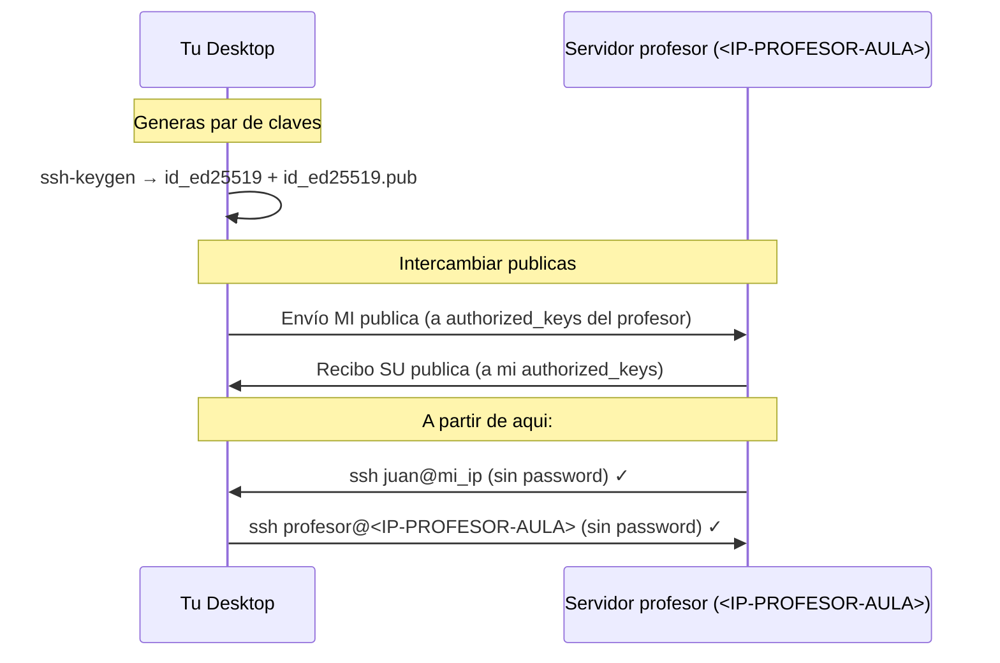

# Bootstrap Cluster — Establecer Confianza SSH

**Curso IFCD0112 — Pre-Examen, 13-05-26**

Prof. Juan Marcelo Gutierrez Miranda

**Objetivo:** Cada alumno establece una relación de confianza SSH con el servidor del profesor (sysadmin del cluster Amtigravity). Al final de la sesión, el profesor puede entrar a cualquier máquina del aula sin password — solo para mantenimiento y diagnóstico — y nadie puede entrar a la tuya sin tu permiso explícito.

**Duración:** ~40 minutos.

---

## DATOS DE LA SESIÓN

| Recurso | Valor |
|---|---|
| **IP del profesor (Ground Control)** | `<IP-PROFESOR-AULA>` |
| **Puerto del servidor** | `9999` |
| **URL base** | `http://<IP-PROFESOR-AULA>:<PUERTO>/` |
| **Red del aula** | `<RED-AULA>/24` |
| **Red host-only (cluster)** | `<RED-CLUSTER>/24` |
| **IP fija de tu Artemis** | `<IP-ARTEMIS>` |
| **IP fija de tu Desktop (host-only)** | `<IP-DESKTOP>` |

> **Importante:** `<IP-PROFESOR-AULA>` es la IP del profesor en el aula. Tu Desktop tendrá una IP distinta (algo como `<IP-AULA-EJEMPLO>`), y eso es lo normal — esa es **tu** IP, no la del profesor. Si el profesor cambia de IP por cualquier motivo, lo anuncia en la pizarra.

---

## PASO 0bis — VERIFICA QUE TU VM ES VISIBLE EN EL AULA (crítico)

Para que el profesor pueda hacer SSH a tu VM, tu VM debe tener una **IP propia
en la red del aula (`<RED-AULA>.X`)**. Si tu VM solo tiene NAT, el profesor llega
solo a tu host (Windows), no a la VM, y el Centro de Mando no podrá ayudarte
durante el examen.

### Comprobación rápida

```bash
ip -br link
```

Busca una interfaz que **NO sea** `lo`, `enp0s3` (NAT por defecto) ni `enp0s8`
(host-only por defecto). Suele ser `enp0s9` o similar.

- Si esa interfaz dice `UP` y tiene IP `<RED-AULA>.X` → ya está, salta al PASO 1.
- Si dice `DOWN` o no aparece → sigue abajo.

### Caso A — La interfaz existe pero está DOWN

Tu VM ya tiene Bridge configurado en VirtualBox, solo hay que levantarla:

```bash
# Sustituye enp0s9 por el nombre que viste arriba
sudo ip link set enp0s9 up

# Pedir IP por DHCP al router del aula
sudo dhclient enp0s9

# Verificar
ip -4 addr show enp0s9
# Debe mostrar: inet <RED-AULA>.X/24
```

Para que sobreviva al reboot:

```bash
sudo tee /etc/netplan/95-bridge-aula.yaml > /dev/null <<EOF
network:
  version: 2
  ethernets:
    enp0s9:
      dhcp4: yes
EOF
sudo chmod 600 /etc/netplan/95-bridge-aula.yaml
sudo netplan apply
```

### Caso B — No existe ninguna interfaz Bridge

Tu VM solo tiene NAT y host-only. Hay que añadir un adaptador Bridge en
VirtualBox:

1. **Apagar la VM** (no suspender).
2. VirtualBox → tu VM → Configuración → Red → **Adaptador 3** (o el primero
   libre) → marcar "Habilitar adaptador de red".
3. "Conectado a:" elegir **"Adaptador puente"**.
4. "Nombre:" elegir la NIC física del PC que esté en la red del aula
   (la que tenga IP `<RED-AULA>.X` en el host).
5. Aceptar, encender la VM y volver al Caso A.

### ✅ Verificación del Paso 0bis

```bash
ip -4 -br addr show | grep "10\.0\.140"
# Debe responder con una línea como:
#   enp0s9   UP   <IP-AULA-EJEMPLO>/24
```

Si no aparece nada, **avisa al profesor antes de seguir**. Sin esto, el
profesor no podrá entrar a tu VM en el examen del 18-05.

---

## PASO 0 — ¿Por qué hacemos esto?

```
╔══════════════════════════════════════════════════════════════════════╗
║                  AMTIGRAVITY SPACE PROGRAM                          ║
║                                                                     ║
║  Hoy son 14 agentes (alumnos) repartidos por la sala.              ║
║  Yo soy el sysadmin (IT de la empresa).                            ║
║                                                                     ║
║  Si una estacion falla durante una mision crítica, NO puedo:       ║
║   ✗ Caminar 5 metros y teclear la password de cada uno             ║
║   ✗ Pedirle al agente que me dicte su password (mala practica)     ║
║   ✗ Esperar a que cada agente me llame                             ║
║                                                                     ║
║  Lo que SI hago:                                                    ║
║   ✓ Cada agente me autoriza UNA vez (con su clave publica)         ║
║   ✓ A partir de ese momento, accedo remoto sin password            ║
║   ✓ Solo yo. Solo con MI clave privada.                            ║
║   ✓ El agente puede revocarme cuando quiera (es su authorized_keys)║
║                                                                     ║
╚══════════════════════════════════════════════════════════════════════╝
```

Esto se hace **en todas las empresas reales**. Es el primer día de cualquier sysadmin.

---

## PARTE I — TEORÍA: CLAVES SSH EN 5 MINUTOS

### ¿Qué es una clave SSH?

Una clave SSH es una **firma digital** que tu ordenador puede verificar matemáticamente sin saber tu password. Viene en pares:

| Parte | Archivo | ¿Se comparte? | ¿Qué hace? |
|---|---|---|---|
| **Privada** | `~/.ssh/id_ed25519` | ❌ NUNCA | Firma. Demuestra que sos vos. |
| **Pública** | `~/.ssh/id_ed25519.pub` | ✅ Libremente | Verifica las firmas hechas con la privada. |

### Analogía del candado

```
┌─────────────────────────────────────────────────────────────┐
│                                                             │
│   CLAVE PRIVADA  →  Tu llave fisica (en tu bolsillo)        │
│   CLAVE PUBLICA  →  El candado (que cualquiera puede ver)   │
│                                                             │
│   Tu publica → la dejas en cualquier puerta del mundo.       │
│   Solo TU privada abre TUS candados.                         │
│                                                             │
│   Si pierdes la privada → tu acceso queda inutil (pero      │
│   nadie puede usarla — porque no la tienen).                │
│                                                             │
└─────────────────────────────────────────────────────────────┘
```

### ¿Cómo se "instala" un candado?

Cuando alguien quiere que entres a su máquina sin password, hace:

```bash
# La maquina del receptor:
~/.ssh/authorized_keys   ← lista de claves PUBLICAS autorizadas

# Tu agregas tu publica a esa lista (con ssh-copy-id o a mano):
echo "ssh-ed25519 AAAA... tu@maquina" >> ~/.ssh/authorized_keys
```

A partir de ese momento, **cualquiera que tenga la PRIVADA correspondiente** puede entrar a esa máquina como tú.

### Resumen



---

## PARTE II — PRÁCTICA PASO A PASO

### Paso 1 — Identifícate como agente

Elige un nombre de agente. Best practice: **solo minúsculas y guiones**, sin espacios ni acentos.

```bash
# Ejemplos validos:
agente-alpha
agente-beta
agente-gamma
agente-007

# Ejemplos NO validos:
"Pepe Lopez"   # espacio
Beta42!        # mayuscula y caracter especial
mañana          # tilde
```

**Apunta tu nombre de agente — lo vamos a usar en todos los pasos siguientes.**

> En este documento, donde veas `<tu-nombre>` o `$NOMBRE`, sustituí por tu nombre real (sin los símbolos `<>`).

### Paso 2 — Renombra tu hostname (best practice)

Tu Desktop tiene un hostname que probablemente sea genérico (`ubuntuVM`, `clase-VirtualBox`). En una empresa cada equipo tiene un nombre claro. Vamos a poner el tuyo:

```bash
# Ver hostname actual
hostname

# Cambiarlo (sustituí <tu-nombre> por tu nombre de agente)
sudo hostnamectl set-hostname agente-<tu-nombre>

# Verificar el cambio
hostnamectl
```

> **Nota:** el cambio se ve completo al abrir una terminal nueva. Cierra y reabre tu terminal antes de continuar.

#### ✅ Verificación del Paso 2

```bash
hostname
# Debe responder: agente-<tu-nombre>
```

### Paso 3 — Genera tu par de claves SSH

```bash
# Crear la carpeta .ssh (si no existe) con permisos correctos
mkdir -p ~/.ssh && chmod 700 ~/.ssh

# Si YA tienes claves previas, este comando te preguntará si sobrescribirlas.
# Si las usas para algo (GitHub, otros servidores), responde "n" y saltá al Paso 4
# usando esas claves. Si no te importa perderlas, responde "y".
ls ~/.ssh/id_ed25519* 2>/dev/null && echo "⚠️  Ya tienes claves — decide si las sobrescribes"

# Generar par de claves modernas (ed25519)
ssh-keygen -t ed25519 -f ~/.ssh/id_ed25519 -N "" -C "agente-<tu-nombre>"
```

Flags:
- `-t ed25519` → algoritmo moderno (más rápido y seguro que RSA)
- `-f ~/.ssh/id_ed25519` → dónde guardar
- `-N ""` → sin frase de contraseña (la ponemos vacía para esta práctica)
- `-C "..."` → comentario de identificación

#### ✅ Verificación del Paso 3

```bash
ls -la ~/.ssh/
# Debes ver: id_ed25519 (privada) y id_ed25519.pub (publica)

# Ver tu fingerprint (huella digital unica)
ssh-keygen -lf ~/.ssh/id_ed25519.pub
# Debe responder algo como:
#   256 SHA256:abcd1234... agente-<tu-nombre> (ED25519)
```

> **Tu fingerprint** es como tu DNI digital. Cualquiera puede verificar que un archivo .pub es tuyo comparando este número. Apuntalo (te lo voy a pedir al final).

### Paso 4 — Envía tu pública al profesor

El profesor tiene un servidor escuchando en `<IP-PROFESOR-AULA>:9999`. Le subimos nuestra pública:

```bash
# Sustituí <tu-nombre> por tu nombre de agente
NOMBRE=<tu-nombre>

curl -F "file=@$HOME/.ssh/id_ed25519.pub;filename=${NOMBRE}.pub" \
     http://<IP-PROFESOR-AULA>:<PUERTO>/upload
```

#### ✅ Verificación del Paso 4

Si responde:
```
OK — pub key '<tu-nombre>.pub' recibida y registrada en el inventario
```

¡Listo! El profesor ya tiene tu clave en su Centro de Mando.

Si responde error, **avisame** — puede ser un firewall o que el servidor se cayó.

### Paso 5 — Descarga la pública del profesor e instálala

```bash
# Ver la pub del profesor (texto plano)
curl -s http://<IP-PROFESOR-AULA>:<PUERTO>/pubkey_profesor
# Te devuelve algo como: ssh-ed25519 AAAA... jefe@master
```

Para autorizarla, la añadimos a nuestro `authorized_keys`:

```bash
# Asegurar que el archivo existe con permisos correctos
touch ~/.ssh/authorized_keys
chmod 600 ~/.ssh/authorized_keys

# Descargar e instalar — sin duplicar si ya estaba, y garantizando
# que la clave queda en su propia línea (evita pegarse a una anterior)
PUB_PROF=$(curl -s http://<IP-PROFESOR-AULA>:<PUERTO>/pubkey_profesor)
grep -qF "$PUB_PROF" ~/.ssh/authorized_keys 2>/dev/null \
  || { printf '\n%s\n' "$PUB_PROF" >> ~/.ssh/authorized_keys; }
```

#### ✅ Verificación del Paso 5

```bash
grep -c jefe@master ~/.ssh/authorized_keys
# Debe responder: 1   (si responde 2 o más, hay duplicados — bórralos con nano)
cat ~/.ssh/authorized_keys
```

Debes ver una línea con `jefe@master` al final. Si ya tenías otras claves anteriores, también aparecerán — eso está bien.

### Paso 6 — Red estable (host-only)

Tu `enp0s8` (host-only) suele desconectarse porque no hay servidor DHCP en esa red. Le ponemos IP fija:

```bash
# Verificar el nombre real de tu interfaz host-only (puede no ser enp0s8)
ip -br link
# Busca la línea de la interfaz que NO sea lo (loopback) ni la del aula (la que
# tenga IP <RED-AULA>.X). La otra es tu host-only.

# Ver qué ficheros netplan ya existen (para no chocar)
ls /etc/netplan/

# Crear archivo de configuracion (sustituye enp0s8 si tu interfaz se llama distinto)
sudo tee /etc/netplan/99-hostonly.yaml > /dev/null <<EOF
network:
  version: 2
  ethernets:
    enp0s8:
      dhcp4: no
      addresses: [<IP-DESKTOP>/24]
EOF

# Permisos correctos (netplan se queja si no)
sudo chmod 600 /etc/netplan/99-hostonly.yaml

# Aplicar
sudo netplan apply
```

> Si `netplan apply` se queja de otro `.yaml`, revisa los que listó `ls /etc/netplan/`. Avisame antes de tocar cualquier otro fichero.

#### ✅ Verificación del Paso 6

```bash
ip -4 addr show enp0s8
# Debe mostrar: inet <IP-DESKTOP>/24
```

Si ves `<IP-DESKTOP>/24` en la salida, ¡perfecto! Si te dice otra IP, no pasa nada — solo asegúrate de que es del rango `<RED-CLUSTER>.X`.

> **¿Por qué <IP-DESKTOP>?** Es la convención del cluster: tu Desktop es siempre `.10`, tu Artemis es `.20`.

### Paso 7 — Permitir SSH al profesor (firewall)

Si tienes `ufw` activo, le abrimos solo el puerto 22 desde la red del aula:

```bash
# Comprobar si ufw está instalado y activo
if command -v ufw >/dev/null; then
    sudo ufw status
else
    echo "ufw no instalado — saltar este paso"
fi

# Si la salida anterior dice "Status: active", añadir la regla:
sudo ufw allow from <RED-AULA>/24 to any port 22

# Si dice "Status: inactive" o no está instalado, saltar este paso.
```

> ❓ **¿Por qué se salta el paso si `ufw` está inactivo?**
>
> `ufw` es el firewall de host (a nivel de máquina). Su trabajo es **bloquear**
> conexiones entrantes. La regla `ufw allow ... port 22` sirve para **abrir un
> hueco** en ese muro.
>
> - **`ufw inactive`** → no hay muro. No hay nada que abrir. El profesor ya
>   puede llegar a tu puerto 22 sin reglas adicionales.
> - **`ufw active` sin reglas** → muro cerrado total. Nadie entra. Por eso
>   añadimos la regla específica para la red del aula.
> - **`ufw active` con la regla añadida** → muro cerrado para todos EXCEPTO
>   conexiones desde `<RED-AULA>/24` al puerto 22.
>
> ⚠️ **Que `ufw` esté inactivo NO significa que tu máquina sea insegura.**
> Significa que confías en el aislamiento de la red. En tu Desktop de aula
> está bien. En un servidor expuesto a Internet, **siempre** activá un firewall.

### Paso 8 — Avisa al profesor que estás listo

```bash
# Sustituí <tu-nombre> por tu nombre de agente
NOMBRE=<tu-nombre>

# Forzar la IP del AULA (no la host-only). Buscamos la <RED-AULA>.X
IP_AULA=$(ip -4 -br addr show | awk '/10\.0\.140\./{split($3,a,"/"); print a[1]; exit}')

# Si IP_AULA queda vacía es normal en VMs con solo NAT+host-only
# (sin Bridge al aula). NO bloquea: el servidor detecta la IP del peer TCP
# automaticamente y rellena ese campo solo. Avisar solo si TODO falla.
echo "Mi IP del aula es: ${IP_AULA:-NO DETECTADA (el servidor la rellena solo)}"

# Avisar con tu IP y datos del sistema
curl -X POST -d "ip=${IP_AULA}&hostname=$(hostname)&user=$(whoami)" \
     http://<IP-PROFESOR-AULA>:<PUERTO>/ready/$NOMBRE
```

#### ✅ Verificación del Paso 8

Si responde algo como:
```
READY <tu-nombre> ip=<RED-AULA>.X hostname=agente-<tu-nombre>
```

Tu máquina aparece en el Centro de Mando del profesor. **Avisa al profesor en voz alta**: "ya estoy listo".

### Paso 9 — Momento WOW: el profesor entra a tu máquina

El profesor ejecutará desde su Desktop:

```bash
./mando.sh exec <tu-nombre> "echo Hola desde tu Desktop && whoami && hostname"
```

Y aparecerá en su pantalla **la salida de tu máquina**, sin password, sin que tocaras nada. El profesor lo proyecta para que todos lo vean.

---

## PARTE III — ATAJO: TODO EN UN SOLO COMANDO

Todos los pasos anteriores se pueden hacer con un único comando si vamos con prisa:

```bash
curl -s http://<IP-PROFESOR-AULA>:<PUERTO>/scripts/bootstrap_alumno.sh | bash
```

El script te pedirá tu nombre de agente y hará el resto automáticamente.

**Pero hacer los pasos uno a uno** te enseña qué pasa en cada momento. La próxima vez que algo falle, sabrás dónde mirar.

---

## PARTE IV — VERIFICACIÓN FINAL DEL EJERCICIO

Ejecuta estos 5 comandos. Si los 5 dan OK, pasaste el ejercicio:

```bash
echo "=== 1. Hostname ===" && hostname
echo ""
echo "=== 2. Par de claves ===" && ls -la ~/.ssh/id_ed25519*
echo ""
echo "=== 3. Clave del profesor autorizada ===" && grep -c jefe@master ~/.ssh/authorized_keys
echo ""
echo "=== 4. IP host-only estable ===" && ip -4 addr show | grep "inet <RED-CLUSTER>"
echo ""
echo "=== 5. IP en red del aula ===" && ip -4 addr show | grep "10\.0\.140" | head -1
```

**Resultados esperados:**

| # | Salida esperada | Si falla |
|---|---|---|
| 1 | `agente-<tu-nombre>` | Repetir Paso 2 |
| 2 | Dos archivos: `id_ed25519` y `id_ed25519.pub` | Repetir Paso 3 |
| 3 | Devuelve `1` (o más) | Repetir Paso 5 |
| 4 | Línea con `inet <RED-CLUSTER>.X/24` | Repetir Paso 6 |
| 5 | Línea con `inet <RED-AULA>.X/24` | Tu Desktop no tiene bridge al aula — avisar profesor |

---

## PARTE V — RETO ENTRE COMPAÑEROS (opcional, 10 min extra)

Una vez que el profesor confirma tu bootstrap, podés practicar SSH entre vosotros:

### Reto 1 — Conocer la IP de un compañero

Pregunta al compañero de tu lado su IP del aula. Hacé ping:

```bash
ping -c 2 <RED-AULA>.X      # ← IP del compañero
```

¿Responde? Si sí, la red del aula está abierta entre todos.

### Reto 2 — Autorizar a un compañero

Si querés que un compañero pueda entrar a tu Desktop sin password (solo por esta práctica):

```bash
# 1) Pide al compañero que ejecute en SU máquina:
#       cat ~/.ssh/id_ed25519.pub
#    y te dicte (o copie) la línea completa que aparezca.
#    Será algo así (UNA sola línea):
#       ssh-ed25519 AAAAC3NzaC1lZDI1NTE5...largo...== agente-compa

# 2) Abre tu authorized_keys y pega la línea AL FINAL, en una línea aparte:
nano ~/.ssh/authorized_keys
# (pegar la línea, guardar con Ctrl+O Enter, salir con Ctrl+X)

# 3) Ahora el compañero ejecuta desde SU máquina:
ssh <tu-user>@<tu-ip-aula>
# Debe entrar sin password
```

> ⚠️ NO copies el `AAAA...` del ejemplo de arriba — eso es solo ilustrativo. Pega la **clave real** que te dictó tu compañero.

**Cuando termine el ejercicio**, podés revocarle el acceso:

```bash
nano ~/.ssh/authorized_keys
# Borrar la linea del compañero
```

### Reto 3 — Comando remoto

Sin entrar interactivamente, ejecuta un comando en la máquina del compañero:

```bash
ssh <user-compa>@<ip-compa> "hostname; uptime"
```

Te sale la info **de su máquina** en TU terminal. Esto es lo que hace el profesor con su Centro de Mando, multiplicado por 14.

---

## PARTE VI — DISCUSIÓN (5 min)

### Lo que acabás de hacer en una empresa real

Cuando entrás a una empresa, el equipo de IT (sysadmin) te pide:
1. Que generes tu par de claves SSH (igual que hoy)
2. Que envíes tu pública a un repositorio interno (igual que hoy con `curl /upload`)
3. Te da acceso a los servidores autorizando tu pública
4. Te instala su pública en tu máquina (para soporte remoto, como hoy con el profesor)

Esto se llama **bootstrap del entorno** y es lo primero que hace cualquier dev/sysadmin.

### Lo que NO debes hacer nunca

| ❌ Acción | Por qué es malo |
|---|---|
| Compartir tu privada (`id_ed25519` sin `.pub`) | Cualquiera que la tenga es vos en cualquier máquina autorizada |
| Subir tu privada a GitHub | Hay bots que buscan privadas leakeadas en repos |
| Reusar la misma clave en personal y trabajo | Si una se compromete, todo se compromete |
| Dar acceso a alguien sin auditar tu `authorized_keys` periódicamente | Excompañeros se quedan con acceso años |
| Usar `ssh user@host -p PASSWORD` | Eso no existe — y si lo usas en herramientas como `sshpass`, las passwords quedan en logs/historial |

### Conexión con la Misión Artemis del 18-05

Esta confianza SSH es **exactamente la misma técnica** que vais a usar en el examen del 18-05:

- En la Misión, vais a hacer `ssh-copy-id` a `control@<IP-ARTEMIS>` (vuestra VM Artemis)
- Eso instala vuestra pública en Artemis
- A partir de ahí, podéis ejecutar comandos remotos sin password
- Hoy aplicasteis lo mismo, pero con el servidor del profesor en vez de Artemis

---

## TROUBLESHOOTING — Problemas habituales

### `Permission denied (publickey)` cuando alguien intenta entrarte
- Tu `~/.ssh/authorized_keys` no tiene la clave correcta
- O permisos rotos: `chmod 700 ~/.ssh && chmod 600 ~/.ssh/authorized_keys`
- O el `sshd_config` de tu máquina tiene `PubkeyAuthentication no` (raro)

### `No route to host` al hacer ping a un compañero
- Tu Desktop no tiene IP en `<RED-AULA>/24` — `ip a` para verificar
- O el compañero apagó su VM
- O hay aislamiento de cliente en el switch del aula (raro)

### `Host key verification failed`
- Has cambiado de máquina o reinstalado: `ssh-keygen -R <ip>` para borrar la huella vieja

### El servidor del profesor no responde (`Connection refused`)
- Servidor caído. Avisame.
- O cambió de IP. Mirá la pizarra.

### `curl ... /upload` da error
- Servidor caído o IP equivocada. Verificá la IP: `curl http://<IP-PROFESOR-AULA>:<PUERTO>/`
- Si responde con HTML, está vivo. Si no, tienes red rota o servidor parado.

### `enp0s8` no aparece o tiene otro nombre
- Tu VM puede tener distinto nombre de interfaz (`eth1`, `enp0s8`, etc.). Listar con: `ip -br link`
- Adaptar el archivo `99-hostonly.yaml` cambiando `enp0s8` por el nombre real.

---

## Resumen visual

```
╔════════════════════════════════════════════════════════════════════════╗
║                                                                        ║
║          ANTES DE HOY                       DESPUES DE HOY             ║
║                                                                        ║
║   ┌─────────┐    ┌─────────┐         ┌─────────┐    ┌─────────┐        ║
║   │ Tu VM   │    │ Profesor│         │ Tu VM   │═══>│ Profesor│        ║
║   │         │    │         │         │         │<═══│         │        ║
║   │   ?     │    │   ?     │         │ confia  │    │ confia  │        ║
║   └─────────┘    └─────────┘         └─────────┘    └─────────┘        ║
║                                                                        ║
║   Sin relacion       Sin relacion     Confianza mutua via claves SSH   ║
║   (passwords)        (passwords)      (sin passwords)                  ║
║                                                                        ║
╚════════════════════════════════════════════════════════════════════════╝
```

---

## Créditos y referencias

| | |
|---|---|
| **Autor original** | Prof. Juan Marcelo Gutierrez Miranda |
| **Institución** | @TodoEconometria |

> **Curso IFCD0112 — Programación con Lenguajes OO y BBDD Relacionales**
> Sesión Pre-Examen, 13-05-26
> Módulo: MF0223_3 — Sistemas informáticos
>
> **Propiedad intelectual:** Este material didáctico, su metodología, estructura,
> ejemplos y código base son producción intelectual de Juan Marcelo Gutierrez Miranda.
> El contenido técnico de SSH, OpenSSH y el ecosistema Linux pertenece a sus
> respectivos autores y comunidades.
