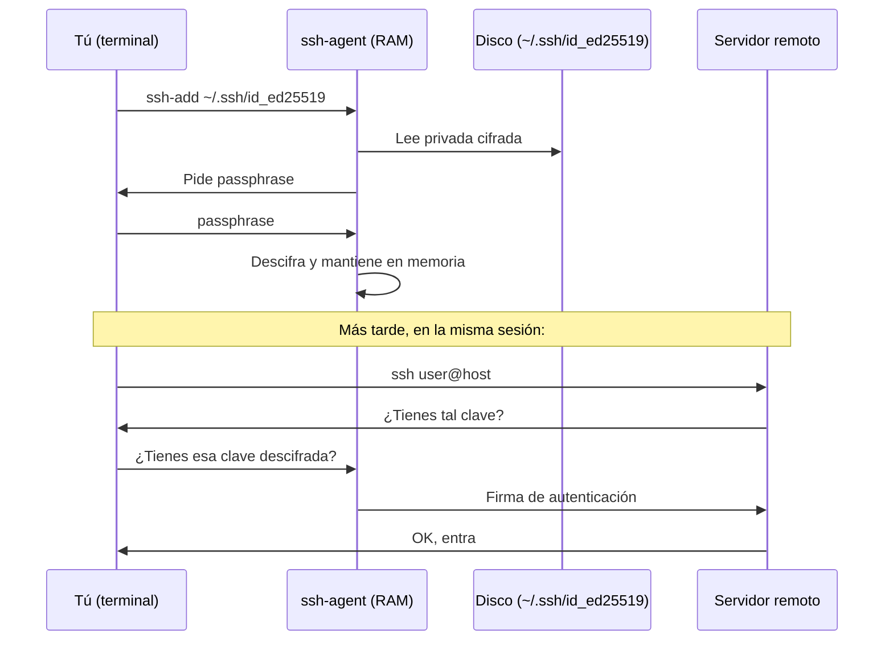

# Bootstrap Cluster — SSH a Producción: un ejemplo completo

**Curso IFCD0112 — Bootstrap Cluster SSH a Producción, 15-05-26**

Prof. Juan Marcelo Gutierrez Miranda

**Pre-requisito:** Haber completado el ejercicio del 13-05-26 (Bootstrap Cluster — Establecer Confianza SSH). Si tu Desktop no puede aún hablar sin password con el servidor del profesor, repite ese ejercicio antes de continuar.

**Objetivo:** Pasar de "tengo claves SSH y funcionan" a usar SSH como **herramienta diaria de trabajo profesional**: aliases, agente, bastión hosts, integración con Git, troubleshooting avanzado.

> 🎯 **Al terminar este documento tendrás el conocimiento del 13-05 (Bootstrap Cluster — confianza SSH) reforzado con un caso completo de producción real** — el mismo tipo de setup que encontrarás el primer día en cualquier empresa donde administres servidores. Lo que aquí practicas no es teoría académica: es lo que un sysadmin junior hace antes de su primer café cada mañana.

**Duración:** ~90 minutos.

---

## DATOS DE LA SESIÓN

| Recurso | Valor |
|---|---|
| **IP del profesor (Ground Control)** | `<IP-PROFESOR-AULA>` |
| **Puerto del servidor** | `9999` |
| **Red del aula** | `<RED-AULA>/24` |
| **Red host-only (cluster)** | `<RED-CLUSTER>/24` |
| **Tu Artemis (host-only)** | `<IP-ARTEMIS>` |
| **Tu Desktop (host-only)** | `<IP-DESKTOP>` |
| **Usuario en tu Desktop** | `<tu-user>` |
| **Usuario en tu Artemis** | `control` |
| **Repositorio personal en GitHub** | `github.com/<tu-usuario>` |

> Si te falta algún dato, repasa el ejercicio del 13-05 o pregunta al profesor antes de empezar.

---

## ⚠️ CÓMO LEER ESTE DOCUMENTO — Prioridades

Cada PARTE está marcada con su relevancia operativa:

| Icono | Significado |
|---|---|
| 🎯 **NOTA IMPORTANTE — PISTA CLAVE** | Contenido **central**. Si no lo domina, no podrá resolver el resto. |
| ⭐ **RECOMENDADO** | Facilita mucho el trabajo diario con SSH. |
| 📚 **AMPLIACIÓN IMPORTANTE** | Formación profesional avanzada — **estudie el fin de semana**. |

> **Si va justo de tiempo:** asegúrese de completar las secciones 🎯 y, si puede, las ⭐. Las 📚 las lee en casa.

---

## 💻 CÓMO ESTUDIAR ESTE DOCUMENTO EN CASA (sin el sistema del aula)

En clase tienes el setup completo: tu Desktop + Artemis + servidor del profesor, todo conectado. Pero **en casa quizás no dispongas del mismo entorno**. Aquí varias formas de seguir aprendiendo:

**Estrategia 1 — Leer y entender sin ejecutar (lo mínimo):**
- Lee cada sección preguntándote **POR QUÉ** se ejecuta cada comando, no solo **QUÉ** hace.
- Anota en un papel los flags que no entiendas y búscalos en `man ssh`, `man ssh-keygen`, `man ssh-agent`.
- Pídele a una IA (ChatGPT, Claude, Gemini) que te explique cada flag y por qué se usa. Hazle preguntas tipo: *"¿qué diferencia hay entre `ssh-copy-id` y copiar manualmente con `cat`?"* o *"¿por qué `chmod 600` y no `chmod 644`?"*.

**Estrategia 2 — Práctica con WSL o una VM cualquiera:**
- Si tienes Windows + WSL, ya tienes una shell Linux. Genera claves dentro de WSL.
- Si tienes VirtualBox o VMware en casa, levanta dos VMs Ubuntu mínimas y simula Desktop ↔ Artemis.
- Aunque no tengas el "Artemis" del aula, **la mecánica de claves, agent y `~/.ssh/config` es idéntica** en cualquier sistema Linux.

**Estrategia 3 — Probar contra ti mismo o un VPS gratuito:**
- Lo más rápido: `ssh localhost` — te conectas a tu propia máquina. Sirve para practicar generación de claves, `authorized_keys`, troubleshooting de permisos.
- VPS gratis: Oracle Cloud Free Tier (siempre gratis), AWS Free Tier (12 meses), Google Cloud ($300 crédito 3 meses).
- GitHub Codespaces: 60 h/mes gratis, te da una shell Linux a la que puedes conectarte por SSH desde tu máquina.

**Estrategia 4 — Si nada de lo anterior es viable:**
- Vuelve el lunes con **dudas concretas anotadas**: *"leí la sección X, no entendí Y, intenté Z"*.
- Esto vale más que llegar el lunes sin haber abierto el documento.

> 🎯 **Lo importante:** entender **QUÉ** hace cada comando y **POR QUÉ**. La fluidez mecánica viene sola cuando tienes sistema disponible. Pero sin entendimiento previo, la repetición mecánica no enseña nada.

---

## DE DÓNDE VENIMOS

```
╔══════════════════════════════════════════════════════════════════════╗
║                                                                      ║
║  13-05  →  Generaste par de claves, tu pública en el authorized_keys ║
║           del profesor, su pública en el tuyo. Confianza mutua.      ║
║                                                                      ║
║  HOY   →  Esa confianza la convertimos en flujo de trabajo:          ║
║           • Aliases para no escribir IPs nunca más                   ║
║           • Tu clave privada protegida con passphrase + agent        ║
║           • Saltar máquinas como un sysadmin de empresa              ║
║           • Conectar todo esto con Git y GitHub                      ║
║           • Resolver problemas reales cuando algo no anda            ║
║                                                                      ║
╚══════════════════════════════════════════════════════════════════════╝
```

---

## 🎯 PARTE 0 — SSH passwordless Desktop → Artemis (10 min) — **NOTA IMPORTANTE — PISTA CLAVE**

> **ES MUY PROBABLE QUE TE ENCUENTRES CON ESTO.** Si solo
> hace una cosa hoy, que sea esta. El resto del documento es valioso pero
> ESTO es lo central.

### El objetivo

Caso típico que debe dominar:
> *"Generar una clave SSH ed25519 en Desktop, copiarla a Artemis,
>  y poder ejecutar `ssh <IP-ARTEMIS>` sin que pida contraseña."*

### Datos del cluster

| Campo | Valor |
|---|---|
| IP de Artemis | `<IP-ARTEMIS>` |
| Usuario en Artemis | `control` |
| Tipo de clave a usar | **`ed25519`** (SIEMPRE) |

### Paso 1 — Generar la clave ed25519 en Desktop

```bash
# Si ya existe ~/.ssh/id_ed25519 del 13-05, SÁLTESE este paso.
ls ~/.ssh/id_ed25519 2>/dev/null && echo "Ya existe, saltar al Paso 2"

# Si no existe:
ssh-keygen -t ed25519 -f ~/.ssh/id_ed25519 -N "" -C "agente-<tu-nombre>"
```

> Aquí no hace falta passphrase. La clave del 13-05 sin passphrase
> es perfectamente válida.

### Paso 2 — Copiar la pública a Artemis (lo crítico)

```bash
ssh-copy-id -i ~/.ssh/id_ed25519.pub control@<IP-ARTEMIS>
# Pedirá la password de 'control' UNA vez. Después nunca más.
```

Si `ssh-copy-id` no está disponible, lo manual:

```bash
cat ~/.ssh/id_ed25519.pub | ssh control@<IP-ARTEMIS> \
    "mkdir -p ~/.ssh && chmod 700 ~/.ssh && \
     cat >> ~/.ssh/authorized_keys && chmod 600 ~/.ssh/authorized_keys"
```

### Paso 3 — Verificar SSH sin password

```bash
ssh control@<IP-ARTEMIS> "echo OK && hostname && whoami"
```

**Resultado esperado:** no pide password, devuelve `OK`, el hostname de Artemis y `control`.

### ✅ Verificación rápida — el test definitivo

```bash
ssh -o BatchMode=yes -o ConnectTimeout=5 control@<IP-ARTEMIS> "echo OK"
# Debe devolver: OK
# Si pide password: BatchMode lo aborta y devuelve error → SSH passwordless NO está bien
```

### Troubleshooting si falla

| Error | Causa | Fix |
|---|---|---|
| `Permission denied (publickey)` | Pública no llegó a Artemis | Repetir Paso 2 |
| `Permissions 0644 for ~/.ssh/id_ed25519 are too open` | Permisos laxos en su clave privada | `chmod 600 ~/.ssh/id_ed25519` |
| `Permissions for ~/.ssh/authorized_keys are too open` (en Artemis) | Permisos laxos en Artemis | En Artemis: `chmod 700 ~/.ssh && chmod 600 ~/.ssh/authorized_keys` |
| Cuelga en `Connecting` | Artemis apagada o sin red host-only | Encender Artemis, verificar `ping <IP-ARTEMIS>` |

> ⚠️ Si le falla por **permisos laxos**, ejecute el script
> `fix-ssh-perms.sh` de la PARTE VII (más abajo). Es la causa #1 de bloqueos.

---

## ⭐ PARTE I — SSH-AGENT: la caja fuerte de tus claves (15 min) — **RECOMENDADO**

### El problema

En el ejercicio del 13-05 generamos la clave con `-N ""` (sin passphrase). Eso significa que tu archivo `~/.ssh/id_ed25519` está **en claro** en el disco: cualquiera que copie ese archivo (o robe tu portátil) puede entrar como tú a cualquier sitio donde esté autorizada tu pública.

En el mundo real **siempre** se cifra la privada con una passphrase. Pero entonces cada vez que haces SSH tienes que escribirla. ¿Cómo equilibrar seguridad y comodidad?

### La solución: ssh-agent

`ssh-agent` es un proceso pequeño que vive en tu sesión y **mantiene las claves descifradas en memoria**. Funcionamiento:

1. Le pides al agent que cargue una clave (`ssh-add`).
2. El agent te pide la passphrase **una vez**.
3. A partir de ahí, cualquier `ssh` que hagas en esa sesión usa la clave del agent — sin password.
4. Cuando cierras la sesión, las claves descifradas desaparecen de la memoria.



### Paso 1 — Generar una clave NUEVA con passphrase

> Vamos a generar una **segunda** clave (con passphrase) sin tocar la del 13-05. Así puedes seguir entrando al servidor del profesor con la vieja y experimentas con la nueva.

```bash
# Si ya existe id_ed25519_seguro (repitiendo el ejercicio), saltá al Paso 2
# para no sobrescribir. Si te lo pregunta, responde "n".
ssh-keygen -t ed25519 -f ~/.ssh/id_ed25519_seguro -C "agente-<tu-nombre>-seguro"
# Esta vez, cuando pida "Enter passphrase", PON UNA. Algo que recuerdes
# pero que no sea tu password del PC.
```

> 👁️ **Por qué no ves lo que escribes en la passphrase:**
> `ssh-keygen` (igual que `sudo`, `passwd` y otras herramientas de seguridad)
> **NO muestra los caracteres** que tecleas — ni asteriscos, ni puntos, nada.
> Es deliberado: evita que alguien por encima del hombro vea la longitud o
> el ritmo del tecleo. Escribe la passphrase a ciegas, pulsa Enter, repítela
> exacto, Enter. Si te equivocas el segundo prompt no coincide y vuelve a pedirla.

> 🔐 **Qué passphrase poner — la regla de oro:**
>
> | Calidad | Ejemplo | Por qué |
> |---|---|---|
> | ❌ Muy débil | `control`, `1234`, `admin` | Diccionario, segundos para romper |
> | ❌ Débil | `Control2026!` | Patrón típico, predecible |
> | ✅ Buena | `caballo correcto batería grapa` | 4 palabras random (diceware) |
> | ✅ Excelente | `7Mango#piano-47Tormenta` | 16+ caracteres aleatorios |
>
> Para **practicar en clase hoy** una passphrase débil sirve — el objetivo es aprender
> el flujo. Para **uso real** (claves que controlan acceso a tus servidores o GitHub),
> mínimo 4 palabras random o 16 caracteres aleatorios. Y nunca reuses la del PC.

#### ✅ Verificación

```bash
ls -la ~/.ssh/id_ed25519_seguro*
ssh-keygen -y -f ~/.ssh/id_ed25519_seguro
# Si te pide passphrase, está bien cifrada ✓
```

### Paso 2 — Arranca el agent y carga la clave

> 🚨 **Pre-check:** verifica que existe la clave que vas a cargar.
> ```bash
> [ -f ~/.ssh/id_ed25519_seguro ] && echo "OK, sigue al Paso 2" || echo "FALTA — vuelve al Paso 1 a generarla"
> ```

```bash
# Comprobar el estado del agent
ssh-add -l

# TRES casos posibles:
#
# CASO A — ya tiene claves: responde con líneas "256 SHA256:... (ED25519)"
#   → Agent activo con claves. Salta directo al ssh-add de abajo.
#
# CASO B — agent activo, vacío: responde "The agent has no identities."
#   → Agent activo pero sin nada cargado. Es lo más común al recién encender.
#   → Salta directo al ssh-add de abajo (mismo que CASO A).
#
# CASO C — no hay agent: responde "Could not open a connection to your
#          authentication agent" o "Error connecting to agent: ..."
#   → No hay agent. Arrancalo:
#       eval "$(ssh-agent -s)"
#       # Y luego el ssh-add de abajo.

# Cargar tu clave nueva (te pedirá la passphrase si la pusiste en el Paso 1)
ssh-add ~/.ssh/id_ed25519_seguro

# Si también quieres mantener cargada la clave del 13-05:
ssh-add ~/.ssh/id_ed25519

# Verificar que el agent las tiene
ssh-add -l
```

#### ✅ Verificación

`ssh-add -l` debe listar tu(s) clave(s) con su fingerprint. Errores comunes:
- `no identities` → el `ssh-add` no se aplicó, repítelo
- `No such file or directory` → la clave no existe, **vuelve al Paso 1**
- `Bad passphrase, try again` → escribe la passphrase del Paso 1

### Paso 3 — Persistencia del agent (que no muera al cerrar terminal)

Cada terminal nuevo arranca su propio agent vacío. Para tener **un agent compartido** por toda tu sesión gráfica:

#### Opción A — systemd-user (Linux moderno, recomendado)

```bash
# Crear el unit del agent como servicio de tu sesión
mkdir -p ~/.config/systemd/user

cat > ~/.config/systemd/user/ssh-agent.service <<'EOF'
[Unit]
Description=SSH key agent

[Service]
Type=simple
Environment=SSH_AUTH_SOCK=%t/ssh-agent.socket
ExecStart=/usr/bin/ssh-agent -D -a $SSH_AUTH_SOCK

[Install]
WantedBy=default.target
EOF

# Decirle a bash dónde está el socket
echo 'export SSH_AUTH_SOCK="$XDG_RUNTIME_DIR/ssh-agent.socket"' >> ~/.bashrc

# Activar
systemctl --user daemon-reload
systemctl --user enable --now ssh-agent.service
```

Cierra todas las terminales, abre una nueva, y verifica:

```bash
echo $SSH_AUTH_SOCK
# Debe responder algo como /run/user/1000/ssh-agent.socket
ssh-add -l
# Vacío al principio. Cargá tu clave de nuevo:
ssh-add ~/.ssh/id_ed25519_seguro
# A partir de aquí, sobrevive a cierres de terminal.
```

#### Opción B — bashrc minimalista (más simple, menos elegante)

Si no quieres systemd, añade a `~/.bashrc`:

```bash
if [ -z "$SSH_AUTH_SOCK" ]; then
    eval "$(ssh-agent -s)" > /dev/null
fi
```

Lo malo: cada terminal arranca su propio agent → tienes que cargar la clave en cada uno. No es lo profesional, pero funciona.

### Paso 4 — Cuando NO te conviene usar agent

| Situación | ¿Agent? |
|---|---|
| Equipo personal de desarrollo | ✅ Sí, con clave **con** passphrase |
| Servidor de producción donde quieres deploy automatizado | ❌ No, usa deploy key sin passphrase y restringe lo que puede hacer |
| Sesión compartida (kiosko, máquina ajena) | ❌ NUNCA cargues tu clave personal ahí |
| CI/CD | ❌ Variables de entorno cifradas o secret manager, no agent |

> 💡 **Resumen rápido — al terminar Parte I tienes 2 claves:**
> - `~/.ssh/id_ed25519` (del 13-05, sin passphrase) — para uso rápido en clase y autorizada en el profe
> - `~/.ssh/id_ed25519_seguro` (nueva, con passphrase) — la "profesional", la que subirás a GitHub

---

## ⭐ PARTE II — ~/.ssh/config: dejar de escribir IPs (20 min) — **RECOMENDADO**

> **¿Por qué recomendado y no obligatorio?** Usted ejecutará `ssh <IP-ARTEMIS>`
> directo, sin obligar a usar alias. Pero crear el alias `artemis` en su config
> le ahorrará escribir la IP 10 veces.

### El problema

Hasta ahora hacías:

```bash
ssh control@<IP-ARTEMIS>
ssh juan@<IP-PROFESOR-AULA>
ssh -i ~/.ssh/id_ed25519 -p 2222 admin@my.cool.server.com
```

Tres problemas:
1. Memorizar IPs y usuarios.
2. Tres tipos de servidor → tres invocaciones distintas.
3. Si cambia algo (puerto, IP) tienes que actualizar **todos** tus scripts.

### La solución: ~/.ssh/config

Un archivo de texto con **bloques `Host`** que mapean un alias a sus parámetros:

```bash
nano ~/.ssh/config
```

Pega esto (adaptado a tus datos):

```ssh-config
# Mi Artemis (host-only, IP fija del cluster)
Host artemis
    HostName <IP-ARTEMIS>
    User control
    IdentityFile ~/.ssh/id_ed25519
    ForwardAgent no

# El servidor del profesor (Ground Control)
Host profe ground-control
    HostName <IP-PROFESOR-AULA>
    User aulas
    IdentityFile ~/.ssh/id_ed25519_seguro

# Wildcard: todos los hosts del cluster usan la misma clave
Host <RED-CLUSTER>.*
    IdentityFile ~/.ssh/id_ed25519
    User control
    StrictHostKeyChecking accept-new

# Defaults para TODOS los hosts (al final, sirve de fallback)
Host *
    ServerAliveInterval 60
    ServerAliveCountMax 3
```

> ⚠️ **`StrictHostKeyChecking accept-new`** solo en redes confiables (aula, cluster interno).
> En servidores expuestos a Internet usa `yes` para verificar fingerprint manualmente la primera vez.

**Permisos correctos** (el `ssh` se queja si están laxos):

```bash
chmod 600 ~/.ssh/config
```

### Ahora puedes hacer

```bash
ssh artemis              # Equivale a ssh -i ~/.ssh/id_ed25519 control@<IP-ARTEMIS>
ssh profe                # Equivale a ssh -i ~/.ssh/id_ed25519_seguro aulas@<IP-PROFESOR-AULA>
ssh ground-control       # Lo mismo que profe (los alias se separan por espacio)
```

### Directivas más útiles

| Directiva | Para qué sirve |
|---|---|
| `HostName` | IP o nombre real del host |
| `User` | Usuario remoto |
| `Port` | Puerto SSH si no es 22 |
| `IdentityFile` | Qué clave privada usar |
| `ForwardAgent` | ¿Reenviar el agent al servidor remoto? (peligroso, ver Parte V) |
| `ProxyJump` | Saltar por un bastión (Parte IV) |
| `StrictHostKeyChecking` | Cómo verificar fingerprints (yes/no/accept-new) |
| `ServerAliveInterval` | Cada N segundos manda un keepalive (evita desconexión) |
| `ConnectTimeout` | Timeout de conexión en segundos |
| `LocalForward` / `RemoteForward` | Port forwarding (Parte VI) |

### Wildcards y orden

SSH lee el archivo **de arriba a abajo** y aplica la PRIMERA directiva que matchee. Por eso:

```ssh-config
Host artemis-*
    User control

Host artemis-prod
    Port 2222

Host *
    User defaultuser
```

Si haces `ssh artemis-prod`, SSH ve:
1. ¿Match `artemis-*`? Sí → User=control
2. ¿Match `artemis-prod`? Sí → Port=2222 (User=control ya fijado)
3. ¿Match `*`? Sí → User intentaría poner defaultuser, pero ya está fijado → ignorado

**Regla del pulgar:** específico arriba, genérico abajo.

### Ejercicio Parte II — Configura tu config completa

Pega esto en `~/.ssh/config` adaptado a tus datos:

```ssh-config
# ── Cluster Amtigravity ─────────────────────────────────────
Host artemis
    HostName <IP-ARTEMIS>
    User control
    IdentityFile ~/.ssh/id_ed25519

# ── Servidor del profesor ──────────────────────────────────
Host profe
    HostName <IP-PROFESOR-AULA>
    User aulas
    IdentityFile ~/.ssh/id_ed25519_seguro

# ── Tu GitHub (lo configuramos en Parte V) ─────────────────
Host github.com
    User git
    IdentityFile ~/.ssh/id_ed25519_seguro

# ── Defaults ───────────────────────────────────────────────
Host *
    ServerAliveInterval 60
    HashKnownHosts yes
```

#### ✅ Verificación

```bash
ssh -G artemis | head -10
# Te muestra TODA la config resuelta para 'artemis': qué IP, user, key, etc.

ssh artemis "echo Conexion OK"
# Debe entrar y volver con 'Conexion OK'

ssh profe "echo Conexion OK"
# Idem para el profesor
```

---

> ☕ **DESCANSO 10 min**. Llevamos 35 min de sesión. Estira las piernas, hidrátate.

---

## 📚 PARTE III — KNOWN_HOSTS: confianza en el servidor (10 min) — **AMPLIACIÓN IMPORTANTE (autoestudio)**

> **Ampliación importante.** Formación profesional sobre **TOFU** (Trust On First Use) y verificación de fingerprints SSH. Léala el fin de semana — útil cuando trabaje en empresa real.

### El problema que resuelve

Cuando haces `ssh artemis` por primera vez, SSH te dice:

```
The authenticity of host '<IP-ARTEMIS>' can't be established.
ED25519 key fingerprint is SHA256:abc123...
Are you sure you want to continue connecting (yes/no)?
```

Esto se llama **TOFU** (Trust On First Use). SSH no tiene forma de saber si **realmente** es Artemis o un atacante haciendo Man-in-the-Middle. La primera vez te pide que confíes; en las siguientes, ya tiene la huella guardada en `~/.ssh/known_hosts` y la verifica automáticamente.

### Qué pasa si el host cambia su huella

Si Artemis se reinstala (o un atacante se cuela), su clave SSH cambia. La próxima conexión te lanza:

```
@@@@@@@@@@@@@@@@@@@@@@@@@@@@@@@@@@@@@@@@@@@@@@@@@@@@@@@@@@@
@    WARNING: REMOTE HOST IDENTIFICATION HAS CHANGED!     @
@@@@@@@@@@@@@@@@@@@@@@@@@@@@@@@@@@@@@@@@@@@@@@@@@@@@@@@@@@@
```

Esto **no es opcional**. SSH se niega a conectarse. Razones posibles:
- a) Reinstalaste el host (legítimo)
- b) Cambiaste de máquina con la misma IP (legítimo)
- c) Alguien está suplantando el host (ataque)

### Resolver

#### Si confías en que es legítimo (a o b):

```bash
# Borrar la huella vieja
ssh-keygen -R <IP-ARTEMIS>

# Reconectar (te volverá a pedir aceptar la nueva)
ssh artemis
```

#### Si NO sabes por qué cambió:

**No aceptes ciegamente.** Verifica el fingerprint del servidor por otro canal:
- Llama al sysadmin
- Conéctate por consola física
- Mira el fingerprint en el panel de tu proveedor cloud

### Inspeccionar known_hosts

```bash
# Ver entradas (con hashes — para no leakear qué hosts visitaste)
cat ~/.ssh/known_hosts | head

# Buscar una entrada concreta
ssh-keygen -F <IP-ARTEMIS>
```

### StrictHostKeyChecking — los 3 modos

En `~/.ssh/config`:

| Valor | Comportamiento |
|---|---|
| `yes` | Si no está en known_hosts, **niega** la conexión. Para servidores críticos |
| `accept-new` | Si no está, lo añade automáticamente la primera vez (TOFU sin pregunta). Útil en redes confiables del aula |
| `no` | Acepta cualquier cambio sin avisar. **PELIGROSO.** Solo para testing efímero |

> **En producción usa `yes` o `accept-new`. NUNCA `no`.**

---

## 📚 PARTE IV — PROXYJUMP: saltar máquinas (15 min) — **AMPLIACIÓN IMPORTANTE (autoestudio)**

> **Ampliación importante.** El bootstrap del curso es Desktop↔Artemis directo, sin bastión. Esta sección le prepara para entornos profesionales reales — empresas que exigen pasar por un bastión host antes de tocar producción.

### El caso real

En empresas serias **no se expone Internet a las máquinas internas**. Sólo el "bastión" (un servidor con acceso restringido) es accesible desde fuera; el resto se accede saltando por él.

```
   Internet                Bastion                   Red interna
   ────────                ───────                   ───────────

  Tú (laptop)  ─────SSH─────►  bastion.empresa.com  ─────SSH─────►  artemis-prod
                                                                    db.prod
                                                                    monitor.prod
                                                                    ...
```

En nuestro caso lo simulamos así:
- Tu Desktop = laptop
- Servidor del profesor (<IP-PROFESOR-AULA>) = bastion
- Tu Artemis (<IP-ARTEMIS>) = máquina interna

> **Nota:** desde el aula tú ya puedes ir directo a tu Artemis (porque es **tu** host-only). Pero si estuvieras "fuera" tendrías que pasar por el profesor. Hoy simulamos ese flujo.

### Forma manual

```bash
# Sin ProxyJump (incómodo): primero SSH al bastión, luego desde él SSH al final
ssh profe
ssh control@<IP-ARTEMIS>    # desde dentro del profe
```

### Forma con `-J`

```bash
ssh -J profe artemis-via-profe
# El -J dice "salta por profe ANTES de ir al destino"
```

Pero `artemis-via-profe` no existe... porque desde el profesor, el host-only del profesor es OTRA red (no la tuya). Para hacer este ejercicio real necesitamos algo accesible desde el profesor.

### El reto: SSH a tu Desktop **desde el profesor**

> 🔑 **Pre-requisito:** SSH a Artemis sin password ya quedó cubierto en la **PARTE 0**
> de este documento. Si aún no lo ha hecho, vuelva
> a PARTE 0 antes de continuar con ProxyJump.

Esto sí funciona porque el profesor ve a tu Desktop por la red del aula.

```bash
# Desde el profesor (ya entraste con ssh profe), hacer SSH a tu Desktop
ssh <tu-user>@<IP-AULA-EJEMPLO>      # con tu IP del aula
```

Para que esto sea automático con un comando:

```bash
ssh -J profe <tu-user>@<IP-AULA-EJEMPLO>
```

Y en config:

```ssh-config
Host mi-desktop-via-profe
    HostName <IP-AULA-EJEMPLO>
    User <tu-user>
    ProxyJump profe
```

Ahora `ssh mi-desktop-via-profe` salta por el profesor automáticamente.

### Cadenas de saltos

Se pueden encadenar:

```ssh-config
Host db-prod
    HostName 10.0.0.5
    User dba
    ProxyJump bastion1,bastion2
```

`ssh db-prod` saltaría: laptop → bastion1 → bastion2 → db-prod.

### Cuándo `ssh -J` falla y qué revisar

| Síntoma | Causa habitual |
|---|---|
| `Permission denied` en el bastión | No tienes tu pública en el bastión |
| `Permission denied` en el destino | No tienes tu pública en el destino (debes propagarla por separado) |
| Cuelga en "Connecting" | El bastión no puede llegar al destino (firewall interno) |
| `Channel open failure` | El bastión tiene `AllowTcpForwarding no` en sshd_config |

---

## 📚 PARTE V — SSH PARA GIT (10 min) — **AMPLIACIÓN IMPORTANTE (autoestudio)**

> **Ampliación importante.** Útil INMEDIATAMENTE después (a partir de Semana 10 trabajaremos Git intensivo).

### Por qué SSH es mejor que HTTPS para Git

Cuando clonas con HTTPS:
```bash
git clone https://github.com/tu-usuario/tu-repo.git
git push   # te pide usuario + token cada vez (o lo cachea)
```

Cuando clonas con SSH:
```bash
git clone git@github.com:tu-usuario/tu-repo.git
git push   # autentica con tu clave SSH, sin password
```

Ventajas SSH:
- No expira como un token HTTPS
- No tienes que tocar usuario/password en scripts
- La misma clave funciona para clonar/push/pull en TODOS tus repos

### Paso 1 — Subir tu pública a GitHub

```bash
# Mostrar tu pública (la que YA tienes)
cat ~/.ssh/id_ed25519_seguro.pub

# Copia la línea ENTERA (empieza con ssh-ed25519...)
```

En GitHub web:
1. Settings → SSH and GPG keys → New SSH key
2. Title: `Desktop aula - 15-05-26`
3. Key type: `Authentication Key`
4. Pega la pública
5. Add SSH key

### Paso 2 — Verificar la conexión

```bash
ssh -T git@github.com
# Primera vez te pedirá aceptar el fingerprint de GitHub (TOFU).
# Acepta SOLO si coincide con uno de los fingerprints oficiales:
#   ED25519: SHA256:+DiY3wvvV6TuJJhbpZisF/zLDA0zPMSvHdkr4UvCOqU
#   RSA:     SHA256:uNiVePAvevwZRDcaiVdrkpvjAUaUMt8gn5SZB5OUC0
#   ECDSA:   SHA256:p2QAMXNIC1TJYWeIOttrVc98/R1BUFWu3/LiyKgUfQM
# Fuente: docs.github.com → "GitHub's SSH key fingerprints"
# Luego responde:
#   Hi <tu-usuario>! You've successfully authenticated, but GitHub does not provide shell access.
```

¡Eso es éxito! GitHub te identifica.

### Paso 3 — Clonar un repo con SSH

```bash
# La URL SSH viene de tu repo: Code → SSH → copy
git clone git@github.com:<tu-usuario>/tu-repo.git

# A partir de aquí, git push y git pull no piden password
```

### Migrar un repo existente HTTPS → SSH

Si ya tienes un repo clonado con HTTPS:

```bash
cd tu-repo
git remote -v               # Verás https://github.com/...
git remote set-url origin git@github.com:<tu-usuario>/tu-repo.git
git remote -v               # Ahora git@github.com:...
git push                    # Verifica con tu clave SSH
```

### Deploy keys vs personal SSH key

| Concepto | Uso |
|---|---|
| **Personal SSH key** | Una sola clave de tu cuenta, acceso a todos tus repos |
| **Deploy key** | Una clave POR repo, solo lectura (o read+write si activas), ideal para servidores |
| **Machine user** | Un usuario "robot" en GitHub con su propia clave SSH, para deploy compartido |

> **Regla:** en servidor de producción usa una **deploy key** del repo concreto, no tu clave personal.

### Agent forwarding — ⚠️ cuidado

`ssh -A user@host` reenvía tu agent al remoto. Eso significa que **el host remoto puede pedirle al agent que firme cosas**. Si el host está comprometido, alguien puede:
- Usar tu clave para entrar a OTROS sitios donde tu pública esté autorizada
- Imitarte sin tener acceso a la privada

**Cuándo SÍ usar `-A`:**
- Saltar de tu laptop a un bastión y desde ahí clonar un repo Git con tu clave personal

**Cuándo NO:**
- Servidores no confiables o compartidos
- Conexiones a hosts que no controlas

Mejor alternativa: ProxyJump (no reenvía agent, solo encadena conexiones).

---

## 📚 PARTE VI — PORT FORWARDING (10 min) — **AMPLIACIÓN IMPORTANTE (autoestudio)**

> **Ampliación importante.** Túneles SSH y SOCKS proxy.

### Qué es

SSH puede crear **túneles**: una conexión que mapea un puerto local con un puerto remoto a través del SSH cifrado. Tres tipos:

| Flag | Significado | Ejemplo |
|---|---|---|
| `-L LOCAL_PORT:HOST:REMOTE_PORT` | Lo que llegue a LOCAL_PORT en MI máquina, sálelo por SSH y conéctalo a HOST:REMOTE_PORT desde el servidor | Acceder a DB privada |
| `-R REMOTE_PORT:HOST:LOCAL_PORT` | Lo contrario: lo que llegue a REMOTE_PORT del servidor, llévalo a HOST:LOCAL_PORT en MI máquina | Exponer mi web local |
| `-D PORT` | SOCKS proxy local — todo el tráfico que mande mi navegador a PORT, sálelo por SSH | Navegar como si estuviera en el bastión |

### Ejemplo `-L`: acceder a un PostgreSQL del cluster sin exponerlo

Imagina que Artemis tiene un PostgreSQL en `<IP-ARTEMIS>:5432` y solo escucha en localhost (no expuesto a la red). Desde tu Desktop:

```bash
# Abre el túnel en background (-N -f: no abre shell, va a background)
ssh -L 5432:localhost:5432 -N -f artemis

# Ahora desde TU Desktop:
psql -h localhost -p 5432 -U tuser miDB
# Conecta como si Postgres estuviera en tu máquina, pero realmente es el de Artemis
```

Para cerrar el túnel:
```bash
# Ver el PID del túnel
ps aux | grep "ssh -L 5432"

# Matar
kill <pid>
```

### Ejemplo `-D`: SOCKS proxy

Útil cuando quieres navegar sitios accesibles solo desde el bastión:

```bash
ssh -D 1080 -N profe
# Configurá tu navegador con SOCKS5 proxy localhost:1080
# Todas las peticiones salen desde el profesor
```

> **Nota de seguridad:** los port forwards los permite el sshd remoto. Si el admin pone `AllowTcpForwarding no` en `sshd_config`, no funcionarán.

---

## 🎯 PARTE VII — TROUBLESHOOTING (15 min) — **CASO 2 — PISTA CLAVE**

> El **Caso 2 (permisos rotos en `~/.ssh`)** es CRÍTICO — causa #1 de que el SSH passwordless
> falle. Apréndalo de memoria. El resto de casos es 📚 ampliación.

### `ssh -vvv` — el debugger universal

```bash
ssh -vvv artemis 2>&1 | head -50
```

Muestra cada paso de la negociación. Las líneas `debug1:` `debug2:` `debug3:` te dicen exactamente:
- Qué fichero de config se está leyendo
- Qué clave intenta usar
- Por qué la rechaza el servidor
- Qué algoritmos están negociando

**Caso 1: clave equivocada**

```
debug1: Trying private key: /home/<tu-usuario>/.ssh/id_rsa
debug1: Trying private key: /home/<tu-usuario>/.ssh/id_ecdsa
debug1: No more authentication methods to try.
Permission denied (publickey).
```

Solución: tu config no apunta a la clave correcta. Verifica `IdentityFile` en `~/.ssh/config`.

**Caso 2: permisos rotos en .ssh**

```
Permissions 0644 for '~/.ssh/id_ed25519' are too open.
```

Solución:
```bash
chmod 700 ~/.ssh
chmod 600 ~/.ssh/id_ed25519
chmod 644 ~/.ssh/id_ed25519.pub
chmod 600 ~/.ssh/authorized_keys
chmod 600 ~/.ssh/config
chmod 644 ~/.ssh/known_hosts
```

Script de fix automático (cubre todas las claves `id_*`, no solo ed25519):

```bash
cat > ~/fix-ssh-perms.sh <<'EOF'
#!/bin/bash
chmod 700 ~/.ssh
# Privadas: cualquier id_* que NO acabe en .pub
find ~/.ssh -maxdepth 1 -type f -name 'id_*' ! -name '*.pub' \
     -exec chmod 600 {} \;
# Publicas y conocidos
find ~/.ssh -maxdepth 1 -type f -name 'id_*.pub' -exec chmod 644 {} \;
[ -f ~/.ssh/authorized_keys ] && chmod 600 ~/.ssh/authorized_keys
[ -f ~/.ssh/config ] && chmod 600 ~/.ssh/config
[ -f ~/.ssh/known_hosts ] && chmod 644 ~/.ssh/known_hosts
echo "Permisos arreglados."
EOF
chmod +x ~/fix-ssh-perms.sh
```

**Caso 3: servidor con algoritmos viejos**

A veces conectas a un servidor antiguo y SSH se niega porque sus algoritmos están deprecated:

```
Unable to negotiate with 10.0.0.1 port 22: no matching host key type found.
Their offer: ssh-rsa,ssh-dss
```

Solución temporal (solo para conectar y luego actualizar el servidor):

```bash
ssh -o HostKeyAlgorithms=+ssh-rsa user@10.0.0.1
```

O en config para ese host:
```ssh-config
Host viejo
    HostName 10.0.0.1
    HostKeyAlgorithms +ssh-rsa
    KexAlgorithms +diffie-hellman-group14-sha1
```

> Estas son tiritas. **La solución real es actualizar el sshd del servidor remoto.**

**Caso 4: el servidor cuelga sin responder**

```bash
ssh -o ConnectTimeout=5 artemis
# Si después de 5s no conecta, salta error en vez de quedarse 30s+
```

Posibles causas:
- Firewall del aula bloquea (verifica con `nc -zv <IP-ARTEMIS> 22`)
- La máquina remota está apagada
- Tu Desktop no tiene IP en la red host-only

**Caso 5: agent forwarding falla con permission denied al hacer git clone via bastión**

Si haces `ssh -A bastion` y desde el bastion `git clone git@github.com:...` te dice permission denied, posibles causas:
- `ForwardAgent no` en config del bastión
- `AllowAgentForwarding no` en sshd_config del bastión
- Tu agent local no tiene cargada la clave de GitHub

```bash
# Verificar agent local
ssh-add -l

# Si está vacío
ssh-add ~/.ssh/id_ed25519_seguro
```

---

## 📚 PARTE VIII — RETO FINAL: BASTIÓN AMTIGRAVITY (15 min) — **AMPLIACIÓN IMPORTANTE (autoestudio)**

> **Ampliación importante.** Reto integrador para autoestudio del fin de semana. Si lo resuelve, ha aprendido SSH a nivel profesional — puede listar este reto en su CV.

### El escenario

Eres dev externo que entra a la red privada de Amtigravity solo a través del bastión `profe`. Tu tarea:

> Desde tu Desktop, ejecuta un comando en tu Artemis sin escribir ninguna IP en línea de comandos. Solo aliases.

### Pista de la solución

Configura en `~/.ssh/config`:

```ssh-config
Host profe
    HostName <IP-PROFESOR-AULA>
    User aulas
    IdentityFile ~/.ssh/id_ed25519_seguro

Host artemis-via-profe
    HostName <IP-ARTEMIS>
    User control
    ProxyJump profe
    IdentityFile ~/.ssh/id_ed25519
```

Y ejecuta:

```bash
ssh artemis-via-profe "uptime && whoami && hostname"
```

### Trampas que vas a encontrar

| Problema | Solución |
|---|---|
| `Permission denied (publickey)` al pasar por profe | Tu pública no está en authorized_keys del profe. Repite Paso 5 del 13-05 |
| `Permission denied (publickey)` al final, en artemis | Tu pública no está en authorized_keys de tu Artemis. Hacer `ssh-copy-id artemis` primero |
| Cuelga en "Connection to profe established... " | El profe no puede llegar a tu host-only (.10/.20) porque está en TU máquina. Este ejercicio solo es 100% real si Artemis fuera accesible desde la red del aula. **Para esta práctica, lo aceptamos como simulacro.** |

### Variante con jump dinámico

```bash
# Sin tocar config: pasar el ProxyJump en línea
ssh -J profe control@<IP-ARTEMIS> "uptime"
```

---

## VERIFICACIÓN FINAL DEL EJERCICIO

Ejecuta estos 7 checks. Si todos dan OK, sabes SSH a nivel profesional:

> Antes de ejecutar: asegurate de que tu agent tiene cargada la clave
> nueva (`ssh-add ~/.ssh/id_ed25519_seguro`). Si no, los checks 5 y 6
> te pedirán passphrase y bloquearán la verificación.

```bash
echo "=== 1. Existe la clave nueva ===" && \
  [ -f ~/.ssh/id_ed25519_seguro ] && echo "OK: $(ls -la ~/.ssh/id_ed25519_seguro)" || echo "FALTA"

echo "=== 2. ssh-agent corriendo y con tu clave ===" && \
  ssh-add -l 2>&1 | head -3

echo "=== 3. ~/.ssh/config con permisos correctos ===" && \
  stat -c "%a %n" ~/.ssh/config 2>/dev/null

echo "=== 4. Alias 'artemis' resuelve ===" && \
  ssh -G artemis 2>/dev/null | grep -E "^(hostname|user|identityfile)" | head -3

echo "=== 5. Alias 'profe' funciona (no debe pedir password) ===" && \
  ssh -o BatchMode=yes -o ConnectTimeout=3 profe "echo OK" 2>&1 | head -1

echo "=== 6. ssh -T git@github.com identifica al usuario ===" && \
  ssh -T -o BatchMode=yes -o ConnectTimeout=5 git@github.com 2>&1 | head -1

echo "=== 7. known_hosts tiene las huellas que usaste hoy ===" && \
  { ssh-keygen -F <IP-ARTEMIS> 2>/dev/null | head -1; \
    ssh-keygen -F <IP-PROFESOR-AULA> 2>/dev/null | head -1; }
```

> `BatchMode=yes` hace que SSH falle inmediatamente si necesitaría pedir password —
> exactamente lo que queremos en una verificación automatizada.

**Resultados esperados:**

| # | Salida | Si falla |
|---|---|---|
| 1 | `OK: -rw-...` | Regenerar con Paso 1 |
| 2 | Una o más líneas con fingerprints | Repetir Paso 2 de Parte I |
| 3 | `600 /home/<user>/.ssh/config` | `chmod 600 ~/.ssh/config` |
| 4 | `hostname <IP-ARTEMIS>`, `user control`, `identityfile ~/.ssh/id_ed25519` | Revisar config |
| 5 | `OK` | Tu pública no está en el profe, profe caído, o agent no tiene la clave |
| 6 | `Hi <tu-usuario>!` | No subiste pública a GitHub (Paso 1 Parte V) o agent vacío |
| 7 | Al menos un `# Host ... found:` | Aún no te conectaste a artemis ni profe hoy |

---

## CASOS REALES DEL MUNDO PROFESIONAL

### Deploy con rsync sobre SSH

```bash
# Subir directorio local a un servidor (sin reescribir lo que no cambió)
rsync -avz --delete ./build/ deploy@servidor:/var/www/html/

# Con --dry-run primero para ver qué haría
rsync -avzn --delete ./build/ deploy@servidor:/var/www/html/
```

### Pair programming con `tmate` (si está disponible)

`tmate` permite compartir tu terminal a otro dev por SSH:

```bash
# Comprobar si tmate ya está instalado
command -v tmate || echo "No instalado — instálalo con sudo apt install tmate"

# Arrancar sesión compartida
tmate

# Te da una URL ssh ssh://xyz123@stream.tmate.io
# El otro dev se conecta con esa URL y ven lo mismo que tú
```

### Backup remoto incremental

```bash
# Snapshot diario con --link-dest (hard-link de lo que no cambia)
rsync -av --delete --link-dest=../yesterday/ \
      /datos/ usuario@backup-server:/snapshots/today/
```

### Ejecutar comando en múltiples servidores

```bash
# Patrón simple: bash + xargs (sin instalar nada)
for host in artemis profe; do echo "── $host ──"; ssh -o BatchMode=yes "$host" uptime; done

# Más serio: ansible (requiere instalación previa con sudo apt install ansible)
# ansible all -i "artemis,profe," -m shell -a "uptime"
```

---

## RESUMEN VISUAL

```
╔═══════════════════════════════════════════════════════════════════════════╗
║                                                                           ║
║   13-05  →  Tienes claves SSH y funcionan                                 ║
║                                                                           ║
║   15-05  →  Las usas como un profesional:                                 ║
║                                                                           ║
║     CAJA FUERTE (agent)  ──────►  Tu clave nunca está en claro            ║
║     ALIASES (config)     ──────►  Nunca más memorizar IPs                 ║
║     BASTIÓN (ProxyJump)  ──────►  Saltás máquinas como red privada        ║
║     KNOWN_HOSTS          ──────►  Detectás suplantaciones                 ║
║     GITHUB SSH           ──────►  git push sin password                   ║
║     PORT FORWARDING      ──────►  Servicios privados accesibles seguros   ║
║     TROUBLESHOOTING      ──────►  Diagnostico en 30 segundos              ║
║                                                                           ║
║   PRÓXIMO:  Aplicar todo esto en una misión real contra reloj             ║
║                                                                           ║
╚═══════════════════════════════════════════════════════════════════════════╝
```

---

## CHEAT SHEET DE BOLSILLO

```bash
# Generar nueva clave
ssh-keygen -t ed25519 -f ~/.ssh/id_NOMBRE -C "comentario"

# Arrancar agent
eval "$(ssh-agent -s)"
ssh-add ~/.ssh/id_ed25519_seguro

# Listar claves en agent
ssh-add -l

# Quitar todas las claves del agent
ssh-add -D

# Mostrar config resuelta para un host
ssh -G nombre-alias

# Conectar con debug
ssh -vvv nombre-alias

# Salto manual
ssh -J bastion destino

# Túnel local
ssh -L 5432:localhost:5432 -N -f host

# Ver fingerprints conocidos
ssh-keygen -F host

# Borrar fingerprint vieja
ssh-keygen -R host

# Fix permisos
chmod 700 ~/.ssh && chmod 600 ~/.ssh/{id_*,config,authorized_keys}

# Test GitHub
ssh -T git@github.com
```

---

## 🎯 CHECKLIST FINAL — lo que tiene que llegar a dominar

Si solo retiene 5 cosas de esta sesión, son estas:

### Imprescindibles (PARTE 0)

1. **Generar clave ed25519** (SIEMPRE usa ed25519):
   ```bash
   ssh-keygen -t ed25519 -f ~/.ssh/id_ed25519 -N "" -C "agente-<tu-nombre>"
   ```

2. **Copiar la pública a Artemis:**
   ```bash
   ssh-copy-id -i ~/.ssh/id_ed25519.pub control@<IP-ARTEMIS>
   ```

3. **Verificar SSH sin password:**
   ```bash
   ssh control@<IP-ARTEMIS> "echo OK"
   ```
   Si pide password, algo no está bien configurado — revise permisos y la pública en Artemis.

### Para el script `estado_nodo.sh`

4. **Ejecutar comandos remotos en Artemis vía SSH:**
   ```bash
   ssh control@<IP-ARTEMIS> "uptime"
   ssh control@<IP-ARTEMIS> "free -h"
   ssh control@<IP-ARTEMIS> "df -h /"
   ```

### Si todo falla — el salvavidas

5. **Fix permisos de `~/.ssh`** (causa #1 de fallos en SSH):
   ```bash
   chmod 700 ~/.ssh
   chmod 600 ~/.ssh/id_ed25519 ~/.ssh/authorized_keys ~/.ssh/config
   chmod 644 ~/.ssh/id_ed25519.pub ~/.ssh/known_hosts
   ```
   Aplíquelo a tiempo y se ahorra horas de troubleshooting.

### El resto (PARTES III, IV, V, VI, VIII)

📚 Ampliación importante. Léanlas el fin de semana — formación profesional valiosa que se aplica desde el primer día en una empresa real.

---

## TROUBLESHOOTING — Top 10 errores comunes

| Error | Causa | Fix rápido |
|---|---|---|
| `Permission denied (publickey)` | Pública no autorizada o clave equivocada | `ssh-add -l` + revisar `IdentityFile` |
| `Permissions 0XXX too open` | Permisos laxos en `~/.ssh/*` | Script `fix-ssh-perms.sh` (ver Parte VII) |
| `Connection refused` | Servidor parado o puerto distinto | `nc -zv host 22` |
| `Connection timed out` | Firewall, red caída | `ping host` primero |
| `Host key verification failed` | Cambió el fingerprint del host | `ssh-keygen -R host` |
| `Could not open authentication socket` | Agent no arrancado | `eval "$(ssh-agent -s)"` |
| `Bad owner or permissions on ~/.ssh/config` | Permisos laxos | `chmod 600 ~/.ssh/config` |
| `Channel open failure` | Bastión bloquea forwarding | Avisar al admin del bastión |
| `ssh-agent: Trace/breakpoint trap` | Agent corrupto | `pkill ssh-agent && eval "$(ssh-agent -s)"` |
| `Pubkey ... cannot be used for authentication` | Clave no aceptada (a veces formato viejo o algoritmo deprecated) | Regenerar con `-t ed25519` |

---

## Créditos y referencias

| | |
|---|---|
| **Autor original** | Prof. Juan Marcelo Gutierrez Miranda |
| **Institución** | @TodoEconometria |

> **Curso IFCD0112 — Programación con Lenguajes OO y BBDD Relacionales**
> Sesión 2 — Bootstrap Cluster Avanzado, 15-05-26
> Módulo: MF0223_3 — Sistemas informáticos
>
> **Propiedad intelectual:** Este material didáctico, su metodología, estructura,
> ejemplos y código base son producción intelectual de Juan Marcelo Gutierrez Miranda.
> El contenido técnico de OpenSSH, ssh-agent, ssh-config y el ecosistema Linux
> pertenece a sus respectivos autores y comunidades:
>
> - OpenSSH: Tatu Ylönen + OpenBSD project
> - ed25519: Daniel J. Bernstein, Niels Duif, Tanja Lange, Peter Schwabe, Bo-Yin Yang
> - rsync: Andrew Tridgell, Wayne Davison
> - Manuales `ssh_config(5)` y `ssh(1)` de OpenBSD man pages
