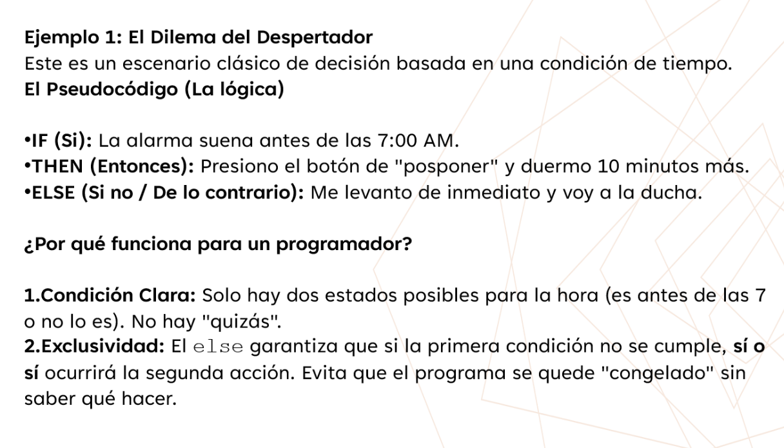
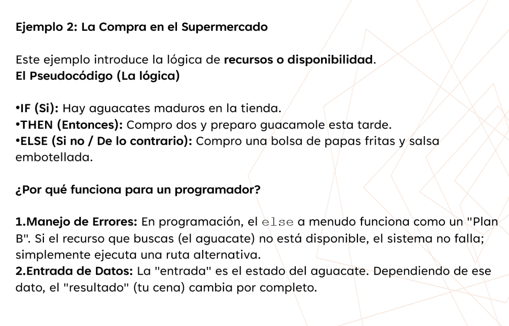
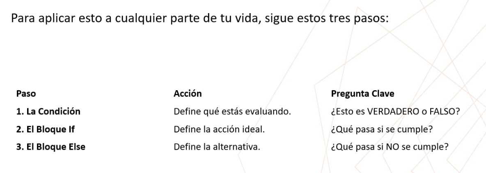
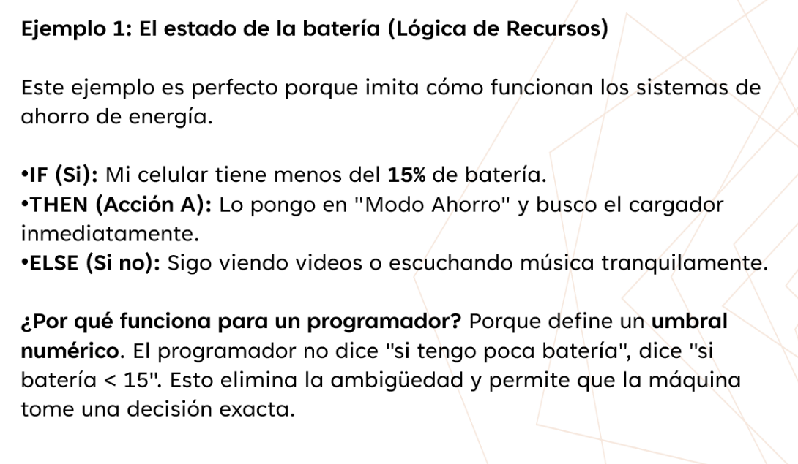

ejemplo 1


ejemplo 2


pasos a seguir 



> Ejemplo : Ir a pasear a Firulais, (condicion: el clima)

````php

// implementacion con codigo PHP

$clima = 'Soleado';
$resultado = "";

if($clima == 'Soleado'){
    $resultado = "Tomo la correo de Firulais, y lo saco a pesear";
}else{
    $resultado = "Me quedo en Casa, espero mejor tiempo";
}
print($resultado);

// otra implementacion
$resultado = $clima == 'lluvia' ? "Me quedo en Casa, espero mejor tiempo" : "Tomo la correo de Firulais, y lo saco a pesear";
print($resultado);

````
 
 ejemplo 3
 
 

> Ejemplo de conduccion, (condicion: la velocidad)
````php

// IMPLEMENTACION EN PHP

// definicion de variables
$velocidad = 130;
$resultado = "";

// validacion de condicional basado en la velocidad
if($velocidad >= 120){

    $resultado = "llego a tiempo a mi destino, 
                   pero Infringiendo leyes de transito  
                   y Arriesgando mi vida en un accidente";
}else{
    
    $resultado = "Podria llegar tarde a mi destino, 
                    pero sano y salvo";
}

// ACORDE AL RESULTADO OBTENIDO DE MUESTRA EL RESULTADO
print($resultado);


````

>Ejemplo de cafeteria: (Condicional: Dinero)
````php

// IMPLEMENTACION EN PHP

// definicion de variables
$billetera = 1000;
$precioCafe = 200;
$resultado = "";

// validacion de condicional basado en el precio 
if($precioCafe <= $billetera ){

    $resultado = "Compro un Cafe";
    $billetera = $billetera - $precioCafe;
    
}else{
    
    $resultado = "No puedo comprar un Cafe";
}

// ACORDE AL RESULTADO OBTENIDO DE MUESTRA EL RESULTADO
print($resultado);
print("Estado de mi billetera",$billetera);

````

>Ejemplo de Calificaciones : (Condicional: Notas)
````php

// IMPLEMENTACION EN PHP

// definicion de variables
$miNota = 14;
$aprobacion = 18;
$resultado = "";

// validacion de condicional basado las notas 
if($miNota == 20 ){

    $resultado = "Apruebo el curso y obtengo un pase Gratis al Cine";
    
}else if($miNota >= $aprobacion){
    
    $resultado = "Apruebo el curso";
    
}else {
    
    $resultado = "No Apruebo el curso, Debo asistir a la recuperacion."
    
}

// ACORDE AL RESULTADO OBTENIDO DE MUESTRA EL RESULTADO
print($resultado);

````

> Ejemplo de ciclo While (condicion: Combustible)

 
````javascript
// defino cuanto combustilbe tengo
let combustible = 3;
// defino una accion por defecto;
//inicializo el bucle que evalua cuando tengo de conbustible
while(combustible > 0){
    // cambio la accion por defecto e indico que pudo conducir y cuando combustible me queda
    accion = `Seguir conduciendo..Me quedan ${combustible} litros de combustible`;
    // muestro en pantalla la accion
    console.log(accion);
    // Resto el combustible por iteracion hasta quedarme en 0litros
    combustible = combustible - 1;  // $combustible--;
}
console.log('Ya no tengo combustible');
// muestro en pantalla la accion final, cuando ya me he queda sin combustible
````

> Ejemplo de listas y diccionarios

````javascript
let datos = {
    "nombre":"Renier",
    "pais":"Venezuela",
    "peso":"65",
    "edad":"44",
    "direccion":"Espña",
    "telefono":"123456778"
}
console.log('DATOS: ', datos.nombre);

let meses = ["Enero","Febrero","Marzo","Abril", "Mayo","Junio","Julio", "etc..."];
console.log('MES: ',meses[0]);

let artistas = 
[
    {"nombre":"Metallica", "genero":"Metal","año":"1989","cancion":"One"},
    {"nombre":"Guns&Roses", "genero":"Rock","año":"1987","cancion":"Don't Cry"},
    {"nombre":"Michael Jackson", "genero":"Pop","año":"1979","Thriller"},
];
console.log ('ARTISTAS: ',artistas[0]);
console.log ('Info: ',artistas[0].nombre);
````
