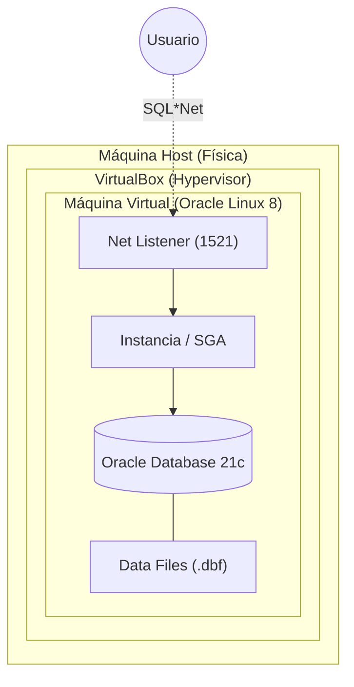

# Guía de Instalación Oracle 21c en VirtualBox

Esta guía presenta la arquitectura y el flujo de trabajo para instalar Oracle Database 21c sobre una máquina virtual.

## 1. Arquitectura del Sistema (UML Deployment)
El siguiente diagrama de despliegue muestra cómo interactúan las capas de hardware y software.



---

## 2. Flujo de Instalación (Diagrama de Actividad)
Pasos detallados desde la creación de la VM hasta la disponibilidad de la base de datos.

```mermaid
flowchart TD
    BuildVM[Crear VM en VirtualBox<br/>|4GB+ RAM, 2 CPUs, 50GB Disk|] --> InstallOS[Instalar Oracle Linux 8.x]
    InstallOS --> Network[Configurar Red y Hostname]
    Network --> PreReq[Instalar 'oracle-database-preinstall-21c']
    PreReq --> UserConf[Configurar contraseñas y grupos de usuarios]
    UserConf --> Stage[Cargar y Descomprimir Binarios .zip]
    Stage --> RunInstaller[Ejecutar Instalador de Software<br/>|./runInstaller|]
    RunInstaller --> RootScripts[Ejecutar Scripts de Root]
    RootScripts --> DBCA[Crear Base de Datos con DBCA]
    DBCA --> Verify[Verificación con SQL*Plus]
```

---

## 3. Detalles de los Componentes

| Componente | Descripción |
| :--- | :--- |
| **VirtualBox Guest Additions** | Mejora el rendimiento gráfico y permite carpetas compartidas. |
| **Pre-install RPM** | Automatiza la creación del usuario `oracle` y la configuración de parámetros del kernel. |
| **Oracle Home** | El directorio donde reside el software ejecutable de la base de datos. |
| **SID (Service ID)** | Identificador único de la instancia de base de datos en el servidor. |

---

## 4. Requisitos Mínimos Sugeridos
*   **RAM:** 4 GB (Deseable 8 GB).
*   **Almacenamiento:** 50 GB de espacio en disco (Dinámico).
*   **Red:** Adaptador Puente (Bridged) o NAT con Reenvío de Puertos.
