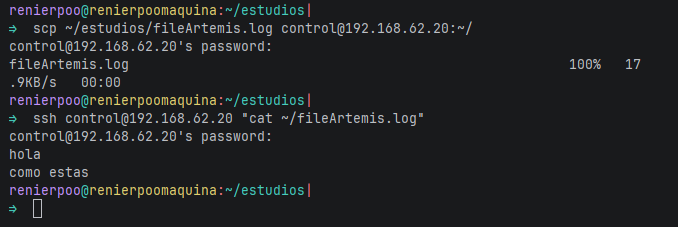

# Variables de Entorno, Scripting Bash y Gestión Kanban — APUNTES

**Certificado:** IFCD0112 | **27-04-26** | Lunes 27 de abril de 2026
**Prof.** Juan Marcelo Gutiérrez Miranda | @TodoEconometría

---

## Reconexión — ¿Dónde estamos?

_(Tus notas aquí)_

---

# BLOQUE 0 — SSH en Acción: Conectarse a Artemis

## ¿Qué es SSH?

```
  ┌───────────────────┐          ssh alumno@192.168.56.20          ┌───────────────────┐
  │     Desktop       │ ──────────────────────────────────────────▶│     Artemis       │
  │  192.168.56.10    │                                            │  192.168.56.20    │
  │  (donde estás)    │◀── exit ───────────────────────────────────│  (servidor)       │
  └───────────────────┘                                            └───────────────────┘
```

_(Tus notas aquí)_

## Comandos SSH

```bash
# Verificar que Artemis responde
ping -c 3 192.168.56.20

# Conectarse
ssh alumno@192.168.56.20

# Dentro de Artemis:
hostname          # artemis
ip addr show enp0s8 | grep "inet "
uptime -p
df -h /
ss -tulnp

# Salir
exit
```

## Ejecutar comando remoto sin entrar

```bash
ssh alumno@192.168.56.20 "hostname && uptime -p"
```

## Copiar archivos entre máquinas (scp)

```bash
# Enviar archivo a Artemis
scp ~/mensaje.txt alumno@192.168.56.20:~/

# Traer archivo desde Artemis
scp alumno@192.168.56.20:~/respuesta.txt ~/
```

> Apuntes
> 
> mover archivo desde desktop hacia artemis
> 
> mover archivos desde artemis hacia desktop
> 


## Referencia SSH

| Comando | Qué hace | Ejemplo |
|---|---|---|
| `ssh usuario@IP` | Abrir terminal remota | `ssh alumno@192.168.56.20` |
| `ssh usuario@IP "cmd"` | Ejecutar sin entrar | `ssh alumno@192.168.56.20 "uptime"` |
| `scp local remoto` | Copiar al servidor | `scp archivo.txt alumno@192.168.56.20:~/` |
| `scp remoto local` | Traer del servidor | `scp alumno@192.168.56.20:~/datos.txt ./` |
| `exit` | Cerrar conexión | `exit` |

---

# BLOQUE I — Variables de Entorno

## ¿Cómo sabe el sistema dónde está `python3`?

_(Tus notas aquí)_

```bash
echo $PATH | tr ':' '\n'
```

```bash
which python3
which git
which inventado
```

### Así busca el shell en el PATH

```
  python3 ←── el usuario escribe esto
     │
     ▼
  ¿Está en /usr/local/sbin?  ──No──▶ ¿Está en /usr/local/bin?
                                          │
                                         No
                                          ▼
                                     ¿Está en /usr/sbin?
                                          │
                                         No
                                          ▼
                                     ¿Está en /usr/bin?
                                          │
                                      Sí ─┘
                                          ▼
                                  Ejecuta /usr/bin/python3

  Si no está en NINGUNA carpeta del PATH → "command not found"
```

_(Tus notas aquí)_

---

## Las variables de entorno son el sistema nervioso de Linux

_(Tus notas aquí)_

```bash
env

echo $HOME
echo $USER
echo $SHELL
echo $LANG
echo $PWD
echo $HOSTNAME
```

### Variables que leen las aplicaciones

| Aplicación | Variable | Para qué |
|---|---|---|
| PostgreSQL | `$PGHOST`, `$PGPORT`, `$PGUSER` | Conexión a la BD |
| Python | `$PYTHONPATH` | Encontrar módulos |
| Docker | `$DOCKER_HOST` | Ubicación del daemon |
| Git | `$GIT_AUTHOR_NAME`, `$GIT_AUTHOR_EMAIL` | Identidad en commits |

---

## Crear y exportar variables

_(Tus notas aquí)_

```bash
SALUDO="Hola desde Artemis"
echo $SALUDO

export CURSO="IFCD0112"
export PROYECTO="launch-control"
echo "Curso: $CURSO, Proyecto: $PROYECTO"

env | grep CURSO
```

### Alcance de variables: local vs export

```
  ┌─────────────────────────────────────┐
  │  Terminal principal                  │
  │                                      │
  │  SALUDO="Hola"        (local)        │
  │  export CURSO="IFCD0112" (exportada) │
  │                                      │
  │  echo $SALUDO → "Hola"     ✓         │
  │  echo $CURSO  → "IFCD0112" ✓         │
  └──────────────┬──────────────────────┘
                 │
                 ▼  (abre script o bash hijo)
  ┌─────────────────────────────────────┐
  │  Terminal hija / script              │
  │                                      │
  │  echo $SALUDO → (vacío)    ✗         │
  │  echo $CURSO  → "IFCD0112" ✓         │
  └─────────────────────────────────────┘

  Regla: sin export = solo esta terminal
         con export = visible para hijos
```

---

## El truco del PATH personal

_(Tus notas aquí)_

```bash
mkdir -p ~/bin

cat > ~/bin/saludo.sh << 'EOF'
#!/bin/bash
echo "══════════════════════════════════════"
echo "  Hola, soy $USER en $(hostname)"
echo "  Fecha: $(date '+%d/%m/%Y %H:%M')"
echo "  Directorio: $PWD"
echo "══════════════════════════════════════"
EOF

chmod +x ~/bin/saludo.sh
~/bin/saludo.sh

export PATH="$PATH:$HOME/bin"
cd /tmp
saludo.sh
cd ~
```

---

## .bashrc — La configuración permanente del shell

_(Tus notas aquí)_

```bash
cat ~/.bashrc
nano ~/.bashrc
```

Agregar al final:

```bash
# ─── Configuración curso IFCD0112 ──────────────────────────
export CURSO_DIR="$HOME/curso_ifcd0112"
export PATH="$PATH:$HOME/bin"

alias ll='ls -la --color=auto'
alias ..='cd ..'
alias ...='cd ../..'
alias gs='git status'
alias glog='git log --oneline -10'

# Alias del cluster
alias ping-artemis='ping -c 3 192.168.56.20'
alias ssh-artemis='ssh alumno@192.168.56.20'
alias estado='~/bin/estado_cluster.sh'
```

```bash
source ~/.bashrc
echo $CURSO_DIR
ll
```

### .bashrc vs .bash_profile

| Archivo | Cuándo se ejecuta |
|---|---|
| `.bash_profile` | Al iniciar sesión (SSH, tty, `su -`) |
| `.bashrc` | En cada terminal nueva (escritorio, tmux) |
| **Regla Ubuntu** | Editar `.bashrc` (cubre ambos casos) |

---

# BLOQUE II — Scripting Bash

## ¿Por qué automatizar?

```
  ┌─── Sin script (cada mañana) ────────────────────┐
  │                                                  │
  │  ping 192.168.56.20                              │
  │  ssh alumno@192.168.56.20                        │
  │  uptime                                          │
  │  df -h                                           │
  │  ss -tulnp                                       │
  │  exit                                            │
  │  → Repetir mañana... y pasado... x 126 días      │
  │                                                  │
  └──────────────────────────────────────────────────┘

  ┌─── Con script (un comando) ─────────────────────┐
  │                                                  │
  │  ./estado_cluster.sh  →  Todo verificado         │
  │                                                  │
  └──────────────────────────────────────────────────┘
```

_(Tus notas aquí)_

---

## Script 1 — Backup del proyecto Launch Control

_(Tus notas aquí)_

```bash
#!/bin/bash
# backup_launch_control.sh — Backup comprimido con fecha

FECHA=$(date +%Y-%m-%d_%H%M)
ORIGEN="$HOME/curso_ifcd0112"
DESTINO="$HOME/backups"
NOMBRE="launch_control_$FECHA.tar.gz"

mkdir -p "$DESTINO"

if [ ! -d "$ORIGEN" ]; then
    echo "ERROR: No existe $ORIGEN"
    echo "Crealo primero: mkdir -p $ORIGEN"
    exit 1
fi

echo "Creando backup..."
tar -czf "$DESTINO/$NOMBRE" -C "$HOME" "curso_ifcd0112"

if [ $? -eq 0 ]; then
    TAMANO=$(du -sh "$DESTINO/$NOMBRE" | cut -f1)
    echo "✓ Backup creado: $DESTINO/$NOMBRE ($TAMANO)"
else
    echo "✗ ERROR al crear el backup"
    exit 1
fi

echo ""
echo "Últimos backups:"
ls -lht "$DESTINO"/launch_control_*.tar.gz 2>/dev/null | head -5
```

```bash
chmod +x ~/bin/backup_launch_control.sh
mkdir -p ~/curso_ifcd0112
echo "archivo de prueba" > ~/curso_ifcd0112/test.txt
backup_launch_control.sh
```

---

## Script 2 — Estado del cluster

_(Tus notas aquí)_

```bash
#!/bin/bash
# estado_cluster.sh — Diagnóstico del cluster y sistema local
# IFCD0112 — Amtigravity Launch Control

ARTEMIS="192.168.56.20"
DESKTOP="192.168.56.10"

echo "═══════════════════════════════════════════"
echo "  ESTADO DEL CLUSTER — $(hostname)"
echo "  $(date '+%A %d de %B de %Y, %H:%M')"
echo "═══════════════════════════════════════════"
echo ""

# ─── Conectividad del cluster ─────────────────────────
echo "[CLUSTER]"

# Verificar Artemis
if ping -c 1 -W 2 "$ARTEMIS" &>/dev/null; then
    echo "  Artemis ($ARTEMIS):  OK"

    UPTIME=$(ssh -o ConnectTimeout=3 -o BatchMode=yes alumno@"$ARTEMIS" uptime -p 2>/dev/null)
    if [ $? -eq 0 ]; then
        echo "  Artemis SSH:         OK — $UPTIME"
    else
        echo "  Artemis SSH:         sin acceso (¿clave SSH configurada?)"
    fi
else
    echo "  Artemis ($ARTEMIS):  SIN RESPUESTA"
fi

if ping -c 1 -W 2 "$DESKTOP" &>/dev/null; then
    echo "  Desktop ($DESKTOP):  OK"
else
    echo "  Desktop ($DESKTOP):  sin respuesta"
fi
echo ""

# ─── Sistema local ────────────────────────────────────
echo "[SISTEMA LOCAL]"
echo "  Usuario: $USER@$(hostname)"
echo "  Disco:   $(df -h / | awk 'NR==2 {printf "%s de %s (%s)", $3, $2, $5}')"
echo "  Memoria: $(free -h | awk '/Mem:/ {printf "%s de %s", $3, $2}')"
echo "  Procs:   $(ps aux | wc -l) totales"
echo ""

# ─── Red local ────────────────────────────────────────
echo "[RED]"
ip -4 addr show | grep "inet " | grep -v "127.0.0.1" | awk '{printf "  %s → %s\n", $NF, $2}'
echo ""

# ─── Proyecto ─────────────────────────────────────────
if [ -d "$HOME/curso_ifcd0112" ]; then
    echo "[PROYECTO LAUNCH CONTROL]"
    ARCHIVOS=$(find "$HOME/curso_ifcd0112" -type f | wc -l)
    TAMANO=$(du -sh "$HOME/curso_ifcd0112" 2>/dev/null | cut -f1)
    echo "  Archivos: $ARCHIVOS | Tamaño: $TAMANO"
fi

echo ""
echo "═══════════════════════════════════════════"
```

```bash
chmod +x ~/bin/estado_cluster.sh
estado_cluster.sh
```

---

## Estructuras de control en Bash

_(Tus notas aquí)_

### Condicionales

```bash
if [ -f ~/.bashrc ]; then
    echo "El .bashrc existe"
else
    echo "No hay .bashrc"
fi

if [ -d ~/curso_ifcd0112 ]; then
    echo "El proyecto existe"
else
    mkdir -p ~/curso_ifcd0112
fi

USUARIO=$(whoami)
if [ "$USUARIO" = "root" ]; then
    echo "PELIGRO: estás como root"
elif [ "$USUARIO" = "jefe" ]; then
    echo "Bienvenido, profesor"
else
    echo "Hola, $USUARIO"
fi
```

### Bucles

```bash
for archivo in ~/curso_ifcd0112/*.txt; do
    echo "Archivo: $(basename "$archivo") — $(wc -l < "$archivo") líneas"
done

for i in $(seq 1 10); do
    echo "Número: $i"
done
```

### Variables especiales en scripts

| Variable | Significado |
|---|---|
| `$0` | Nombre del script |
| `$1`, `$2` | Primer, segundo argumento |
| `$#` | Número de argumentos |
| `$?` | Código de salida (0 = éxito) |
| `$@` | Todos los argumentos |

```bash
#!/bin/bash
echo "Script: $0"
echo "Argumentos: $#"
echo "Primero: $1"
echo "Segundo: $2"
echo "Todos: $@"
```

---

## Ejercicio práctico — Script de monitorización

_(Tus notas aquí)_

```bash
#!/bin/bash
# monitor.sh — Monitorizar un directorio
# Uso: monitor.sh /ruta/directorio [intervalo_segundos]

DIRECTORIO="${1:-.}"
INTERVALO="${2:-5}"

if [ ! -d "$DIRECTORIO" ]; then
    echo "ERROR: $DIRECTORIO no es un directorio"
    exit 1
fi

echo "Monitorizando: $DIRECTORIO (cada ${INTERVALO}s)"
echo "Ctrl+C para detener"
echo ""

while true; do
    ARCHIVOS=$(find "$DIRECTORIO" -type f | wc -l)
    TAMANO=$(du -sh "$DIRECTORIO" 2>/dev/null | cut -f1)
    ULTIMO=$(find "$DIRECTORIO" -type f -printf '%T@ %p\n' 2>/dev/null | \
             sort -rn | head -1 | cut -d' ' -f2-)
    echo "[$(date '+%H:%M:%S')] Archivos: $ARCHIVOS | Tamaño: $TAMANO | Último: $(basename "$ULTIMO" 2>/dev/null)"
    sleep "$INTERVALO"
done
```

```bash
chmod +x ~/bin/monitor.sh
monitor.sh ~/curso_ifcd0112 3
```

---

## Mini-ejercicio — Script de info de red

_(Tus notas aquí)_

```bash
#!/bin/bash
# info_red.sh — Mostrar información de red de la máquina

echo "═══════════════════════════════════════════"
echo "  INFO RED — $(hostname)"
echo "═══════════════════════════════════════════"
echo ""

echo "🌐 INTERFACES DE RED:"
ip -4 addr show | grep -E "inet |^[0-9]" | while read -r linea; do
    if echo "$linea" | grep -q "^[0-9]"; then
        IFACE=$(echo "$linea" | awk -F: '{print $2}' | tr -d ' ')
        echo ""
        echo "  Interfaz: $IFACE"
    fi
    if echo "$linea" | grep -q "inet "; then
        IP=$(echo "$linea" | awk '{print $2}')
        echo "    IP: $IP"
    fi
done
echo ""

echo "🚪 GATEWAY:"
ip route | grep default | awk '{printf "   %s vía %s\n", $5, $3}'
echo ""

echo "📡 DNS:"
if [ -f /etc/resolv.conf ]; then
    grep "^nameserver" /etc/resolv.conf | awk '{printf "   %s\n", $2}'
fi
echo ""

echo "🌍 CONECTIVIDAD:"
if ping -c 1 -W 2 8.8.8.8 &>/dev/null; then
    echo "   Internet: ✓ OK"
else
    echo "   Internet: ✗ Sin conexión"
fi

echo ""
echo "🔌 PUERTOS ESCUCHANDO:"
ss -tlnp 2>/dev/null | grep LISTEN | awk '{printf "   %s (%s)\n", $4, $NF}' | head -10

echo ""
echo "═══════════════════════════════════════════"
```

```bash
chmod +x ~/bin/info_red.sh
info_red.sh
```

---

# BLOQUE III — Kanban y Lógica Computacional

## El tablero Kanban

_(Tus notas aquí)_

```
┌─────────────────┬─────────────────┬─────────────────┐
│    📋 TO DO     │  🔨 IN PROGRESS │    ✅ DONE      │
├─────────────────┼─────────────────┼─────────────────┤
│                 │                 │                 │
│                 │                 │                 │
└─────────────────┴─────────────────┴─────────────────┘
```

| Regla | Detalle |
|---|---|
| WIP limit | Máximo 1-2 tareas en progreso |
| Regla de 2 días | Si lleva +2 días en progress → dividir o reportar |
| Herramienta | Trello — tablero de la clase |

---

## Pseudocódigo — Ejemplo

_(Tus notas aquí)_

```
FUNCIÓN autenticar_usuario(nombre, contraseña):
    usuario = buscar_en_bd(nombre)

    SI usuario NO existe:
        DEVOLVER error("Usuario no encontrado")

    SI contraseña NO coincide con usuario.contraseña_hash:
        DEVOLVER error("Contraseña incorrecta")

    DEVOLVER token_sesion(usuario.id)
FIN FUNCIÓN
```

---

## Diagramas de flujo con Napkin.ai

_(Tus notas aquí)_

| Tipo de diagrama | Cuándo lo usamos |
|---|---|
| Diagrama de flujo | Lógica y algoritmos (HOY) |
| Diagrama E-R | Diseño de bases de datos (Fase II) |
| Diagrama de clases | Arquitectura POO Python (Fase III) |
| Diagrama secuencia | Flujo de llamadas API REST |

---

## Ejercicios de lógica — Pseudocódigo

### Ejercicio A — Clasificar una contraseña

```
Dado una contraseña (texto):
- Si está vacía → "Sin contraseña"
- Si tiene menos de 8 caracteres → "Débil"
- Si tiene 8+ y solo letras/números → "Media"
- Si tiene 8+, letras + números + símbolos → "Fuerte"
```

_(Tu pseudocódigo aquí)_

### Ejercicio B — Verificar nodos del cluster

```
Dada una lista de IPs de nodos (ej: 192.168.56.10, .20, .101, .102):
Para cada nodo: hacer ping
  SI responde → guardarlo en "activos"
  SI NO responde → guardarlo en "caídos"
Mostrar cuántos activos y cuántos caídos
```

_(Tu pseudocódigo aquí)_

### Ejercicio C — Validar un email básico

```
Reglas: exactamente un @, no primero ni último, punto después del @, sin espacios
```

_(Tu pseudocódigo aquí)_

### Ejercicio D — Contar palabras únicas

```
"el gato y el perro y el gato" → 4 (el, gato, y, perro)
```

_(Tu pseudocódigo aquí)_

---

## Script que valida contraseña — Del pseudocódigo al código

_(Tus notas aquí)_

```bash
#!/bin/bash
# validar_password.sh — Clasificar fuerza de contraseña

if [ $# -eq 0 ]; then
    echo "Uso: validar_password.sh <contraseña>"
    exit 1
fi

PASSWORD="$1"
LONGITUD=${#PASSWORD}

if [ $LONGITUD -eq 0 ]; then
    echo "🚫 Sin contraseña"
    exit 1
fi

if [ $LONGITUD -lt 8 ]; then
    echo "🔴 DÉBIL — Solo $LONGITUD caracteres (mínimo 8)"
    exit 0
fi

TIENE_LETRAS=0
TIENE_NUMEROS=0
TIENE_SIMBOLOS=0

echo "$PASSWORD" | grep -q '[a-zA-Z]' && TIENE_LETRAS=1
echo "$PASSWORD" | grep -q '[0-9]' && TIENE_NUMEROS=1
echo "$PASSWORD" | grep -q '[^a-zA-Z0-9]' && TIENE_SIMBOLOS=1

if [ $TIENE_LETRAS -eq 1 ] && [ $TIENE_NUMEROS -eq 1 ] && [ $TIENE_SIMBOLOS -eq 1 ]; then
    echo "🟢 FUERTE — $LONGITUD caracteres, letras + números + símbolos"
elif [ $TIENE_LETRAS -eq 1 ] && [ $TIENE_NUMEROS -eq 1 ]; then
    echo "🟡 MEDIA — $LONGITUD caracteres, letras + números (falta símbolo)"
else
    echo "🟡 MEDIA — $LONGITUD caracteres, pero le falta variedad"
fi
```

```bash
chmod +x ~/bin/validar_password.sh
validar_password.sh "abc"
validar_password.sh "abcdefgh"
validar_password.sh "abc12345"
validar_password.sh "Abc123!@"
```

---

## Referencia rápida

### Variables de entorno

| Concepto | Comando |
|---|---|
| Ver todas | `env` o `printenv` |
| Ver una | `echo $VARIABLE` |
| Crear temporal | `VARIABLE="valor"` |
| Exportar | `export VARIABLE="valor"` |
| Añadir al PATH | `export PATH="$PATH:/nueva/ruta"` |
| Hacer permanente | Añadir al `~/.bashrc` |
| Aplicar cambios | `source ~/.bashrc` |
| Encontrar ejecutable | `which programa` |

### Scripting Bash

| Concepto | Sintaxis |
|---|---|
| Shebang | `#!/bin/bash` |
| Hacer ejecutable | `chmod +x script.sh` |
| Variable | `NOMBRE="valor"` |
| Usar variable | `"$NOMBRE"` |
| Salida de comando | `RESULTADO=$(comando)` |
| Condicional | `if [ cond ]; then ... fi` |
| Archivo existe | `[ -f archivo ]` |
| Directorio existe | `[ -d directorio ]` |
| Comparar strings | `[ "$A" = "$B" ]` |
| Comparar números | `[ $A -lt $B ]` |
| Bucle | `for x in lista; do ... done` |
| Código de salida | `$?` (0 = éxito) |

---

## Tarea 13 — Entrega en Classroom

**Fecha límite:** Martes 28 de abril a las 09:00

1. Script `estado_cluster.sh` funcionando + captura
2. Pseudocódigo de los 4 ejercicios de lógica (A, B, C, D) en `.md`
3. Diagrama de flujo de Napkin.ai para Ejercicio A o C (captura)
4. Captura del tablero Trello con al menos 3 tareas organizadas

Entregar en `~/curso_ifcd0112/tareas/tarea_13/`

---

## Autoevaluación

1. ¿Qué comando muestra dónde está un ejecutable en el PATH?
   > `which programa`

2. ¿Cuál es la diferencia entre `VARIABLE="valor"` y `export VARIABLE="valor"`?
   > Sin export: solo visible en el shell actual. Con export: visible para procesos hijos.

3. ¿Dónde se guardan las variables permanentes en Ubuntu?
   > En `~/.bashrc`

4. ¿Qué hace `source ~/.bashrc`?
   > Recarga la configuración del shell sin cerrar la terminal.

5. ¿Qué significa `$?` en un script?
   > El código de salida del último comando (0 = éxito, otro número = error).

6. ¿Qué es el WIP limit en Kanban?
   > Máximo de tareas que pueden estar en "In Progress" al mismo tiempo (1-2).

7. ¿Por qué escribimos pseudocódigo antes de codificar?
   > Para pensar la lógica independientemente del lenguaje, detectar edge cases y tener un plan antes de implementar.

---

> **Curso IFCD0112 — Programación con Lenguajes OO y BBDD Relacionales**
> Material complementario de estudio
>
> **Autor:** Prof. Juan Marcelo Gutierrez Miranda
> **Institución:** @TodoEconometria
>
> Este documento es un recurso bibliográfico adicional para los alumnos del curso.
> Módulo: MF0223_3 — Sistemas informáticos
>
> ---
>
> **Propiedad intelectual:** Este material didáctico, su metodología, estructura,
> ejemplos y código base son producción intelectual de Juan Marcelo Gutierrez Miranda.
> El contenido técnico de Linux y sus ecosistemas pertenece a sus respectivos autores
> y comunidades; la organización pedagógica, las explicaciones, los diagramas y el
> enfoque metodológico son obra original del autor.
>
> **Hash de Certificación:** `7a3f1b9c4d2e8f6a5b0c7d9e1f3a2b4c6d8e0f1a3b5c7d9e2f4a6b8c0d1e3f5a`
