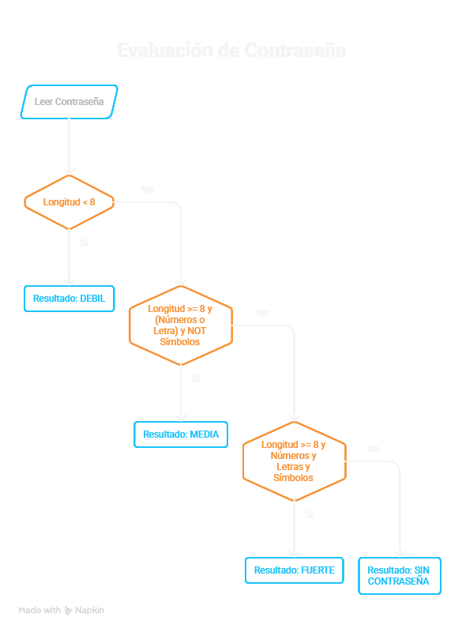
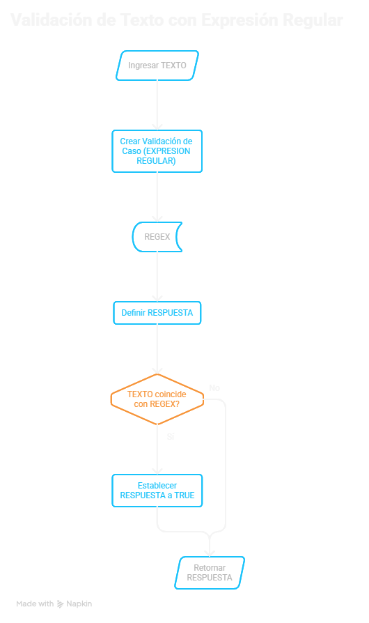
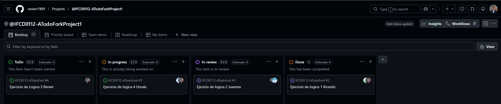

# INTEGRANTES DEL GRUPO
### ATodoFork
- #### [Juan Castillejo]
- #### [Renier Vargas]
- #### [Ricardo Zevallos]
- #### [Ursula Millán]

-----

## Pseudocodigo

### Ejercicio A — Clasificar una contraseña

LEE CONTRASEÑA

SI LONGITUD CONTRASEÑA < 8
THEN RESULTADO = "DEBIL"

SINO LONGITUD CONTRASEÑA >= 8 & NUMEROS O LETRA & NOT SIMBOLOS
THEN RESULTADO = "MEDIA"

SINO LONGITUD CONTRASEÑA >= 8 & & NUMEROS & LETRAS & SIMBOLOS
THEN RESULTADO = "FUERTE"

ELSE
THEN RESULTADO = "SIN CONTRASEÑA"
 
### Ejercicio B — Verificar nodos del cluster

definimos la lista 
nodos=("192.168.56.10" "192.168.56.20" "192.168.56.101" "192.168.56.102")

definimos array para ip activas y caidas
Activos()
Caidos()

Comprobacion si la lista o el fichero esta vacio

if lista = 0
echo "lista vacia"
exit 

bucle para ping a ip

for ip in lista[@]
    if ping -c 1 -W 1 "$ip"
        echo nodo $ip ok
        activos+=("ip")
    else
        echo nodo $ip caido
        caidos+=("ip")


echo activas activos[@]
echo caidos caidos[@]

si no responde ninguno
if activos[]=0
echo ninguno activo

echo activos[*]
echo caidos[*]

### Ejercicio C — Validar un email básico

se ingresa un TEXTO
creo una validacion de caso (EXPRESION REGULAR)
REGEX: [contiene el simbolo "@"],[el simbolo "@" no esta al inicio ni al final],[hay un punto despues del simbolo "@"],[no hay espacios en blanco]
defino la RESPUESTA en FALSE por defecto
IF: el TEXTO incide con la regla del REGEX THEN
RESPUESTA: TRUE
END IF
retorno el contenido de RESPUESTA

### Ejercicio D — Contar palabras únicas

INICIO
#DEFINO LAS VARIABLES - ¿Qué voy a necesitar?
  TEXTO  frase = "el gato y el perro y el gato"  
  LISTA  listas_unicas = []  #Es una lista VACIA para uso mas adelante
  LISTA palabras = SEPARAR(frase, " ")  #Corta el texto cada vez que vea un espacio

 #RECORRO LA LISTA  completa - agrupar las palabras
  PARA CADA palabra EN palabras:                     
      SI palabra NO ESTÁ EN listas_unicas ENTONCES
          agregar palabra a listas_unicas
      FIN SI
  FIN PARA

 #MUESTRO EL RESULTADO - Mostrar cantidad(enteros) y nombres de la lista única
  ENTERO cantidad_total = CONTAR_ELEMENTOS(listas_unicas)
  IMPRIMIR "Palabras distintas: " + cantidad_total
FIN

### Diagrama Ejercicio A — Clasificar una contraseña



### Diagrama Ejercicio C — Validar un email básico



### Tablero del proyecto 



### URL publica del tablero

```
https://github.com/users/renier1989/projects/2
```