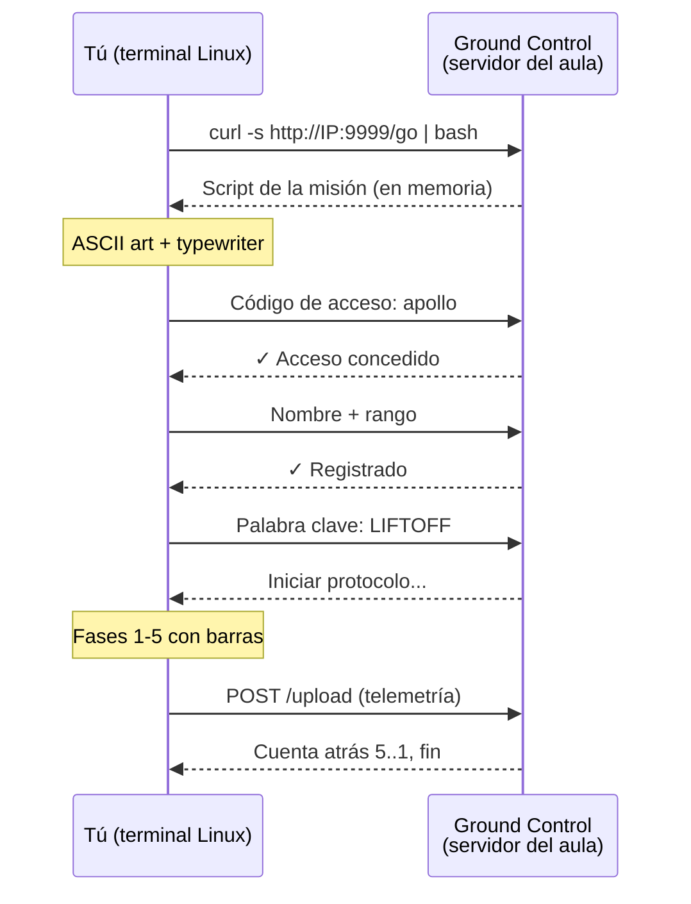
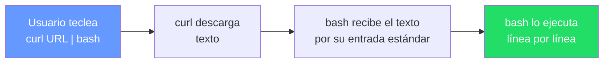
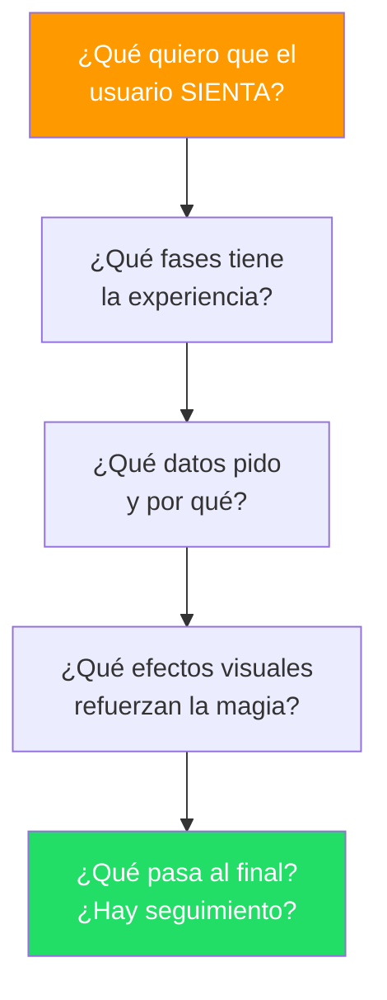
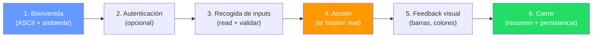
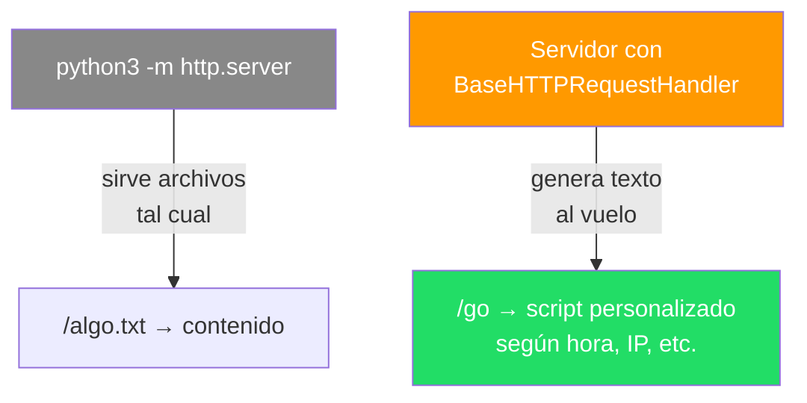
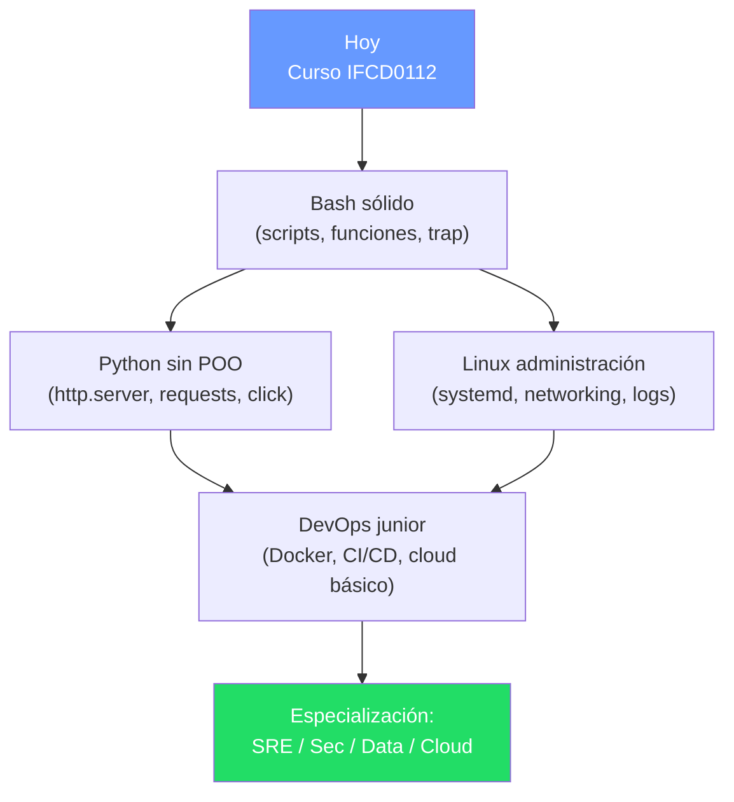
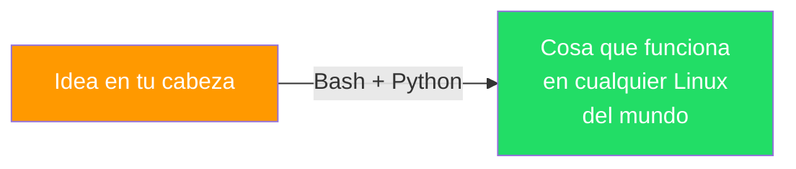
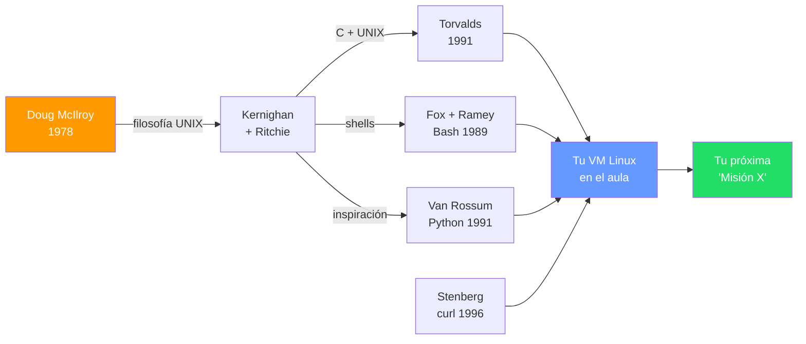

# Construye tu propia "Misión Artemis"

> **Autor:** Prof. Juan Marcelo Gutierrez Miranda
> **Curso:** IFCD0112 — Programación con Lenguajes Orientados a Objetos
>            y Bases de Datos Relacionales (SEPE)
> **Centro:** Centro de Tecnologiás de la Información San Blas / TodoEconometria — 2026
> **Material:** complementario al examen "Misión Artemis 18-05-26"
> **Cita sugerida:**
> Gutierrez Miranda, J. M. (2026). *Construye tu propia "Misión Artemis":
> Bash + Python para crear experiencias en terminal*. Material docente
> IFCD0112, Amtigravity.

---

> **De jugador a creador.** Acabas de vivir una experiencia interactiva en
> terminal: tecleaste un código, hablaste con Ground Control, viste barras
> de progreso, recibiste tu rango. Tres minutos, sensación de videojuego.
>
> **¿Y si te dijera que hacer algo así es más fácil de lo que parece?**
> Esta guía te enseña el patrón mental para que TÚ construyas tu próxima
> "Misión X" — sin copiarme el código, pensando como diseñador.

---

## 1. Lo que viviste (recordatorio rápido)



Lo que SENTISTE: una experiencia diseñada.
Lo que tu **terminal** estaba haciendo: tres cosas simples encadenadas con
mucho cariño.

---

## 2. La cocina: tres ideas y ya está

| Pieza | Qué es realmente | Tu mente cuando lo descubres |
|---|---|---|
| **`curl`** | Un programa que descarga texto desde una URL | "ah, como wget pero con esteroides" |
| **`\| bash`** | Le dice a Bash: "ejecuta lo que acabas de descargar como si yo lo hubiera escrito" | "espera... ¿se puede hacer eso?" |
| **El servidor** | Un programa Python de unas pocas líneas que devuelve texto cuando le piden `/go` | "¿tan poco?" |

Mezcla los tres, añade `read`, `echo`, `sleep`, un poco de ASCII art, y tienes
una "experiencia". El secreto NO es el código — es **diseñar la experiencia**.

---

## 3. ¿Por qué aprender esto en 2026? (motivación de verdad)

Estamos en la era de la IA. Te puedes preguntar: *"¿para qué Bash si la IA me
escribe código?"* Respuesta corta: **porque la IA escribe código que se ejecuta
en algún sitio. Ese sitio es Linux. Y Linux se habla con Bash.**

### Casos reales donde alguien gana dinero haciendo justo esto

| Sector | Lo que automatizan con Bash + Python | Sueldo orientativo* |
|---|---|---|
| **DevOps / SRE** | Scripts de despliegue, backups, monitorización, recuperación ante caídas | 35-65k€/año junior, 70-120k€ senior |
| **Ciberseguridad** | Reconocimiento de redes, scripts de pentesting, auditoría continua | 30-55k€ junior, 70-100k€ senior |
| **Data engineering** | Pipelines de datos, ETLs, orquestación con cron/Airflow | 40-75k€ junior-mid |
| **Soporte L2/L3** | Diagnóstico remoto, scripts de "primera respuesta", onboarding de máquinas | 25-40k€ |
| **Cloud (AWS/GCP/Azure)** | Infraestructura como código, scripts de provisión, automatización de costes | 40-90k€ |

\* Datos orientativos España, sector tech, 2025-2026.

### El patrón que verás en TU primer día de trabajo

```bash
curl -fsSL https://sh.rustup.rs | sh           # instala Rust
curl -fsSL https://get.docker.com | sh         # instala Docker
curl -o- https://raw.githubusercontent.com/nvm-sh/nvm/v0.39.0/install.sh | bash  # NVM
brew install ...                                # Mac
```

**Cada vez que un developer instala una herramienta nueva, está usando el
mismo patrón que la Misión Artemis.** No exagero.

---

## 4. El patrón `curl | bash`: comprende lo que hace ANTES de usarlo



### Lo bueno

- **Cero instalación**: nada queda en disco si el script no quiere
- **Siempre la última versión**: el servidor decide qué te envía
- **Una sola línea**: barrera de entrada bajísima

### Lo PELIGROSO (y por qué tienes que saberlo)

> "Confiar es bueno; verificar es mejor." — Lenin (sí, te lo cito en clase de Bash)

El día que ejecutes en producción `curl http://lo-que-sea | bash`, estás
diciendo: *"servidor desconocido, ejecuta lo que quieras en mi máquina con
mis permisos."* Reglas para no acabar en un periódico:

| Regla | Cómo se aplica |
|---|---|
| Solo URLs HTTPS | Sin TLS, cualquiera en la red puede inyectar código |
| Solo dominios que conoces | `get.docker.com` ✓, `instal-fre3.tk` ✗ |
| Lee primero, ejecuta después (al menos la primera vez) | `curl URL > script.sh; less script.sh; bash script.sh` |
| Verifica firmas/hashes si el proveedor las publica | Las distros serias lo hacen |

En la Misión Artemis era seguro: te lo daba tu profesor en una red controlada.
En la calle: **siempre desconfía**.

---

## 5. Diseña la experiencia ANTES de escribir código

Esto es la diferencia entre un script aburrido y una "Misión X". Antes de
abrir el editor, contesta a estas 5 preguntas:



### Ejemplo real: si Artemis fuera una hamburguesería

| Pregunta | Decisión de diseño |
|---|---|
| ¿Qué quiero que sienta? | Hambre, urgencia, "estoy en una cocina molona" |
| Fases | Saludo → carta → personalización → confirmación → recogida |
| Datos | Nombre + plato + extras + alergias |
| Magia | ASCII art de hamburguesa, "🔥 Cocinando..." con barras |
| Final | Ticket impreso + ETA + número de pedido |

**Date cuenta:** todo esto se puede hacer 100% en terminal con Bash + un
servidor Python. No necesitas web, ni móvil, ni framework de moda.

---

## 6. Anatomía de tu "Misión X" — los 6 ingredientes



### Comandos Bash que cubren los 6 ingredientes (sin código completo)

| Ingrediente | Herramientas que ya conoces | Investiga (búsquedas para Google/IA) |
|---|---|---|
| Bienvenida | `echo`, `cat`, `clear` | "ascii art generator", "bash typewriter effect" |
| Autenticación | `read -s` (input oculto), `if`, `==` | "bash 3 attempts loop", "bash hide password input" |
| Recogida de inputs | `read`, `select`, `case` | "bash select menu", "bash validate input number" |
| Acción | Lo que tu misión necesite (`ip`, `ping`, `curl`, `df`...) | depende del proyecto |
| Feedback visual | `printf`, `\r` (carriage return), `tput`, colores ANSI | "bash progress bar one liner", "bash colors tput" |
| Cierre | `curl -X POST`, redirección a fichero, `tee` | "bash post json with curl", "bash cleanup trap" |

> **Truco de oro:** no intentes escribir los 6 ingredientes a la vez. Empieza
> por el **3** (read), añade el **1** (echo bonito), prueba el **5** (una barra
> tonta), y el resto sale solo.

---

## 7. Python en una línea: el servidor que cabe en un tweet

Lo más sorprendente de la Misión Artemis es lo poco que hace falta del lado
del servidor. Sin saber **nada** de Programación Orientada a Objetos puedes
montar un servidor HTTP así:

```bash
# UNA SOLA LÍNEA. En cualquier carpeta. Y ya tienes un servidor web.
python3 -m http.server 9999
```

Ahora cualquier máquina de tu red puede:

```bash
curl http://TU_IP:9999/cualquier_archivo
```

### ¿Y si quiero que el servidor responda algo dinámico (como `/go`)?

Aquí Python hace algo que en Bash sería un dolor: con **20-30 líneas** y solo
funciones (sin clases tuyas, herencia básica de una clase ya hecha por Python)
puedes responder lo que tú quieras a cada URL.



### Comparativa: lo que Python te ahorra

| Tarea | Sin Python (en Bash puro) | Con Python (sin POO compleja) |
|---|---|---|
| Servir un archivo | Instalar Apache/Nginx + configurar | `python3 -m http.server` |
| Recibir un POST con JSON | `nc` + parsear a mano (horror) | 5 líneas con `http.server` |
| Generar HTML/JSON dinámico | Plantillas con `sed`/`awk` (frágil) | f-strings + diccionarios |
| Mantener "estado" entre peticiones | Ficheros + locks | Variables globales (para empezar) |

> **Mensaje:** Bash es perfecto para **automatizar el sistema**. Python es
> perfecto para **construir herramientas**. Aprenderás a oler cuándo cambiar
> de uno a otro. Por ahora: si necesitas red, datos estructurados o lógica
> compleja, abre Python.

---

## 8. Tu reto: 5 ideas con dificultad creciente

Empieza por la primera. Cuando funcione, sube un nivel. **No mires mi código
del servidor**, te quitarías la mejor parte.

### Nivel 1 — "Saludo personalizado" (1 hora)
```
Script Bash que pregunta tu nombre y tu lenguaje favorito,
y te muestra un mensaje de bienvenida con ASCII art.
```
Aprendes: `read`, `echo`, `cat <<EOF`, variables.

### Nivel 2 — "Diagnóstico de mi máquina" (2-3 horas)
```
Script que hace un mini-recon: muestra tu IP, hostname, espacio
en disco, RAM libre, último login. Con barras de progreso fake.
```
Aprendes: `ip`, `df`, `free`, `who`, `printf`, `\r` para reescribir línea.

### Nivel 3 — "Quiz interactivo" (1 día)
```
Script que te hace 10 preguntas del temario del curso, valida
respuestas (acepta sinónimos), lleva puntuación, y al final
te da un rango (Padawan, Jedi, Maestro).
```
Aprendes: arrays Bash, `case`, `select`, validación.

### Nivel 4 — "Tu propio Ground Control" (1 fin de semana)
```
Versión simplificada de Artemis:
- Servidor Python con `python3 -m http.server` sirviendo un .sh
- Script Bash que pide nombre y manda los datos por curl POST
- Servidor que guarda los reportes en una carpeta
```
Aprendes: HTTP básico, `curl -X POST`, separación cliente/servidor.

### Nivel 5 — "Misión inventada por ti" (proyecto fin de curso)
```
Diseña una experiencia completa para un caso real que te interese:
- "Ground Control" para tu equipo de gaming
- "Ritual matutino" que te resume el día (clima, agenda, noticias)
- "Onboarding" para nuevos compañeros de tu empresa
- Bot conversacional simple para ayudar a tu familia con su PC
```
Aprendes: a pensar como product designer, no solo como coder.

---

## 9. Errores que TODOS cometemos (incluido tu profesor)

| Síntoma | Causa típica | Lección |
|---|---|---|
| "Mi servidor no responde desde otra máquina" | Escucha en `127.0.0.1` en vez de `0.0.0.0` | Loopback ≠ red. La diferencia se paga en horas perdidas |
| "Funciona en mi PC pero no en el aula" | Firewall, NAT, o estás en otra subred | Antes de retocar código: `ping`, `curl`, comprobar la red |
| "Cuelga al rato" | Servidor single-threaded + cliente que abandona | Aprende `ThreadingHTTPServer` cuando saltes a Python serio |
| "El script no ejecuta lo que descargué" | Saltos de línea Windows (`\r\n`) en vez de Unix (`\n`) | `dos2unix` o configurar tu editor a LF |
| "Mi `curl \| bash` falló a medias" | Internet se cortó a mitad de descarga | Para producción: descarga primero, ejecuta después |
| "Otros compañeros lo usaron mal y ahora no funciona" | Falta de validación de inputs | Trata todo input como hostil, **siempre** |

**Cada uno de estos errores te enseña más que un mes de tutoriales.** Buscadlos
a propósito.

---

## 10. ¿Por dónde sigo? (rutas de aprendizaje)



### Términos para buscar (en este orden)

1. **Bash:** `getopts`, `trap`, `set -euo pipefail`, `here-doc`, `process substitution`
2. **Python:** `http.server`, `BaseHTTPRequestHandler`, `f-strings`, `argparse`, `pathlib`
3. **Red:** `tcpdump`, `nmap`, `wireshark`, modelo OSI, NAT vs Bridge vs Host-Only
4. **Sistema:** `systemd`, `journalctl`, `cron`, `rsync`, permisos avanzados
5. **Seguridad:** OWASP Top 10, principios de mínimo privilegio, gestión de secretos

---

## 11. Mensaje final

Acabas de pasar una prueba pensado para que **no fuera una prueba**. Lo que
sentiste fue casi tan importante como lo que aprendiste:

> **La tecnología es un material como la madera o el barro.**
> Puedes hacer una mesa funcional o puedes hacer una mesa que **emocione**.

Bash y Python son tus primeras herramientas. Pequeñas, viejas, pero **no han
caducado en 30 años y no caducarán en otros 30**. Domínalas y tendrás
superpoder permanente: convertir ideas en cosas que funcionan.



Ahora: cierra esta guía y abre tu terminal.

---

## Referencias y agradecimientos

> Esta guía no inventa nada. Solo conecta piezas que **otras personas crearon
> con genialidad y regalaron al mundo**. Sin ellos no existirías como
> developer. Aprende sus nombres, te van a perseguir el resto de tu carrera.

### Las herramientas que usas (y quién las hizo)

| Herramienta | Creador(a/es) original(es) | Año | Dónde leer más |
|---|---|---|---|
| **Bash** (Bourne Again SHell) | Brian Fox y Chet Ramey (GNU Project) | 1989 | <https://www.gnu.org/software/bash/> |
| **curl** y libcurl | Daniel Stenberg | 1996 | <https://curl.se/> |
| **Python** | Guido van Rossum | 1991 | <https://www.python.org/> |
| **Módulo `http.server`** | Equipo core de Python (basado en `BaseHTTPServer` de Jeremy Hylton) | 2000s | <https://docs.python.org/3/library/http.server.html> |
| **GNU/Linux** (kernel) | Linus Torvalds (kernel) + Richard Stallman (GNU userland) | 1991 / 1983 | <https://www.kernel.org/> · <https://www.gnu.org/> |
| **HTTP** | Tim Berners-Lee y el W3C | 1991 | <https://www.w3.org/Protocols/> |
| **SSH (OpenSSH)** | Tatu Ylönen (SSH original) · OpenBSD team (OpenSSH) | 1995 / 1999 | <https://www.openssh.com/> |
| **Mermaid** (los diagramas de esta guía) | Knut Sveidqvist | 2014 | <https://mermaid.js.org/> |
| **VirtualBox** | Innotek → Sun → Oracle | 2007 | <https://www.virtualbox.org/> |
| **Markdown** | John Gruber y Aaron Swartz | 2004 | <https://daringfireball.net/projects/markdown/> |

### Lecturas y libros que merecen estar en tu mesa

- **Brian W. Kernighan & Rob Pike**, *The UNIX Programming Environment* (1984)
  — El libro que enseña a "pensar en UNIX". Sigue vigente en 2026.
- **Brian W. Kernighan & Dennis M. Ritchie**, *The C Programming Language* (1978)
  — Para entender por qué Linux/curl/bash existen como existen.
- **Eric S. Raymond**, *The Art of Unix Programming* (2003) — gratuito online en
  <http://www.catb.org/~esr/writings/taoup/html/>
- **Mark Lutz**, *Learning Python* — para profundizar Python sin POO innecesaria.
- **Documentación oficial** (siempre la primera fuente):
  Bash <https://www.gnu.org/software/bash/manual/> ·
  Python <https://docs.python.org/3/> ·
  curl <https://curl.se/docs/manpage.html>

### Filosofía detrás de todo esto

> *"Write programs that do one thing and do it well.
> Write programs to work together.
> Write programs to handle text streams,
> because that is a universal interface."*
>
> — **Doug McIlroy**, Bell Labs, ~1978
> (la "filosofía UNIX" — el ADN de Bash, curl, Python y la Misión Artemis)



**Cuando ejecutas `curl ... | bash` estás moviendo agua por una red de canales
que cavaron entre los años 70 y los 90 personas que nunca te conocerán pero
que siguen siendo tus profesores.** Devuélveselo: comparte lo que aprendas.

---

*Misión Artemis — Amtigravity Space Program 2026
Material docente del curso IFCD0112
Prof. Juan Marcelo Gutierrez Miranda — todoeconometria.com*
