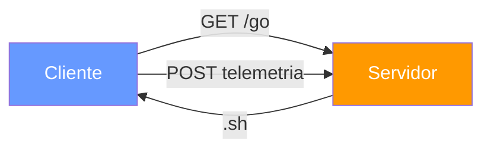
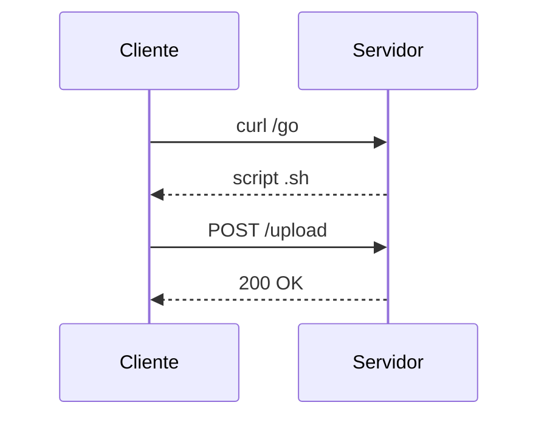
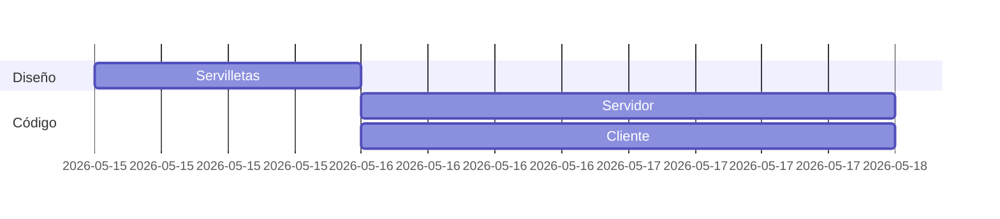

# Guía de documentación de proyectos — Fin de Fase I

> **Curso:** IFCD0112 — Programación con Lenguajes OO y BBDD Relacionales
> **Para:** todos los alumnos (Team Leaders y componentes)
> **Apoya a:** `INFORME_TEAM_LEADER_PLANTILLA.md` · `INFORME_COMPONENTE_PLANTILLA.md`
> **Tiempo de lectura:** 15-20 minutos. Léelo entero antes de empezar a rellenar las plantillas.

---

## 0. Antes de empezar — esta guía NO es lo típico

Cuando uno entrega un trabajo de cole, el profe quiere que respondas lo
que él ya sabe. Aquí es distinto:

> **El profesor quiere ver cómo pensaste, qué decidiste, qué descartaste,
> con quién trabajaste y qué te llevas. El qué hiciste lo verá en el
> repo. El cómo pensaste solo lo verá en tu informe.**

Esto significa:

- **Documentar no es decorar.** Si suprimes una sección entera, el informe
  pierde una dimensión real del proyecto.
- **Lo importante NO es que esté bonito**, sino que el siguiente
  developer (puede ser tu yo de dentro de 6 meses, puede ser tu jefe
  futuro) pueda entender el proyecto leyendo tu informe.
- **Tus reflexiones sobre el equipo cuentan tanto como tu Mermaid.**
  Las dos cosas se evalúan.

---

## 1. Las tres técnicas de documentación que usamos en este curso

### 1.1. Napkin sketch

> **Qué es:** un dibujo rápido a mano, hecho ANTES de escribir código,
> que captura la idea en su forma más cruda. La servilleta es a un
> diseño técnico lo que un boceto a un cuadro: te ahorra horas de
> trabajo en la dirección equivocada.

**Para qué sirve:**
- Pensar SIN preocuparte de la sintaxis.
- Detectar problemas conceptuales en 5 minutos en vez de en 5 horas.
- Tener algo que enseñar a tus compañeros antes de tocar un teclado.

**Cómo se hace:**
1. Coge un papel (o servilleta, o pizarra) y un boli.
2. Dibuja las **cajas** (componentes, máquinas, archivos clave).
3. Dibuja las **flechas** (qué le pasa qué a quién).
4. Pon **nombres cortos** a cada caja y cada flecha.
5. Hazle una foto y úsala en tu informe.

**Regla de oro:** si tu servilleta inicial es idéntica a tu arquitectura
final, o no pensaste nada, o no implementaste nada. En proyectos reales
**siempre** hay cambios.

**Ejemplo válido:**
```
+----------+         GET /go         +-----------+
| Cliente  | <---------------------- | Servidor  |
| (VM-1)   | ----- POST /upload ---> | (VM-2)    |
+----------+                         +-----------+
                                          |
                                    guarda en /reports/
```

---

### 1.2. Diagramas Mermaid

> **Qué es:** un "lenguaje" de texto que GitHub, Markdown y la mayoría
> de editores convierten automáticamente en un diagrama. Lo escribes
> como código en un bloque de Markdown y se renderiza solo.

**Por qué es útil:**
- Vive **dentro del repo** (no es una imagen suelta que se pierde).
- La IA lo escribe bien (con supervisión).
- Lo puedes versionar con Git como cualquier otro código.
- Es el estándar en empresas modernas para diagramas en READMEs.

#### Tipos que tienes que conocer (y cuándo usar cada uno)

##### `graph LR` / `graph TD` — flowchart

Para arquitectura de componentes, flujos de decisión.



##### `sequenceDiagram` — secuencia temporal

Para interacciones entre actores en el tiempo (cliente-servidor,
proceso A → proceso B → proceso C). Tu Misión Artemis era esto.



##### `gantt` — cronograma

Para mostrar fases del proyecto en el tiempo (Team Leader).



##### `classDiagram` — clases UML *(opcional, lo veremos en Fase III)*

Si tu equipo tocó algo de POO en Python o pseudo-clases en Bash,
puedes incluirlo. Si no, no fuerces.

#### Reglas para que tus diagramas no sean basura

1. **No más de 8-10 cajas por diagrama.** Si necesitas más, divide en dos.
2. **Nombres cortos y concretos.** "Servidor VM-2" mejor que "Servidor".
3. **Las flechas TIENEN que tener etiqueta.** Una flecha sin texto es ruido.
4. **Si pones colores, que signifiquen algo.** Cliente azul / Servidor
   naranja / Almacenamiento verde — y mantén la convención.
5. **Prueba el render ANTES de entregar.** GitHub renderiza Mermaid
   nativamente; abre tu .md en GitHub.com y confirma que se ve.

---

### 1.3. El proceso "IA + crítica"

> **Importante:** en este curso te pedimos que uses IA para generar
> tus diagramas Mermaid. NO porque sea lo único válido — sino porque
> queremos enseñarte el patrón profesional: **pedir → revisar → corregir**.

#### El proceso correcto (3 pasos)

**Paso 1 — Pedir bien.** No le pidas "hazme un diagrama del proyecto"
a secas. Dale CONTEXTO:

```
Tengo un proyecto donde un cliente (VM Ubuntu con IP 192.168.56.10)
descarga un script bash desde un servidor Python http.server que
corre en otra VM (192.168.56.1, puerto 9999). El cliente ejecuta
el script y envía telemetría con curl POST. Dame un sequenceDiagram
de Mermaid mostrando este flujo, con los puertos y métodos HTTP.
```

**Paso 2 — Revisar antes de pegar.** La IA se equivoca. Lo más típico:

- Inventa pasos que no existen ("autenticación con token" cuando no lo
  hay).
- Omite pasos que sí existen ("olvida" el POST de telemetría).
- Usa nombres genéricos ("Cliente") en lugar de los tuyos
  ("VM-Alumno-04").

**Paso 3 — Corregir a mano y documentar la corrección.** Esto es lo que
te diferencia. En tu informe, tienes una sección con:

1. Tu prompt literal.
2. El output crudo de la IA.
3. Una tabla con los cambios que hiciste y por qué.

Esto es lo que un equipo serio espera de ti en tu primer trabajo:
**que uses herramientas modernas pero mantengas el criterio.**

---

## 2. Cómo argumentar (no enumerar)

La mayoría de informes mediocres tienen este problema: listan cosas en
lugar de defenderlas. Diferencia:

| Enumerar (malo) | Argumentar (bien) |
|---|---|
| "Usé `curl`, `bash`, `python3` y `ssh`." | "Usé `curl` porque necesitaba pedir el script al servidor con un único comando portable; descarté `wget` porque queríamos también usar el mismo binario para el POST de telemetría, y `wget` no lo hace de forma directa." |
| "El servidor escucha en el puerto 9999." | "El servidor escucha en 9999 porque los puertos por debajo de 1024 requieren root, y queríamos que el aula pudiera arrancarlo sin `sudo`. 9999 está libre por convención en redes privadas." |
| "Trabajamos en equipo." | "Nos dividimos por capas (red, servidor, cliente). Cada uno hizo PR a `develop` y nos revisábamos en mob programming antes de mergear. En la última semana el cuello fue el cliente porque dependía de servidor + red estabilizados." |

> **Regla:** después de cada frase, pregúntate "¿por qué?". Si tienes
> respuesta, escríbela. Si no, esa frase sobra.

---

## 3. Errores típicos que te van a costar puntos

| Error | Por qué baja nota | Cómo evitarlo |
|---|---|---|
| Copiar el README de la herramienta | No demuestra que la entendiste | Escribe con tus palabras qué USO le diste TÚ |
| Diagramas Mermaid genéricos ("Cliente" → "Servidor") | No identifica tu proyecto concreto | Usa los nombres reales: "VM-Alumno-Pablo" → "Servidor-aula" |
| Decir "todo salió bien" en la reflexión | O eres robot o no quieres mojarte | Cuenta UN problema real, aunque sea menor |
| Reflexión del equipo con frases vacías | Aquí se ve la honestidad | Sé concreto con situaciones, no juicios |
| Pegar 200 líneas de código | No sabes elegir lo importante | Elige 3-5 momentos clave |
| Ausencia total de la sección de IA | Hoy nadie programa sin IA — fingirlo se nota | Documenta el proceso real, equivocaciones incluidas |
| No probar el render del Markdown antes de entregar | Tablas rotas, Mermaid que no se ve | Abre el archivo en GitHub.com antes de avisar |

---

## 4. Lo que se evalúa (rúbrica resumida — 10 puntos)

| Apartado | Peso | Qué busca el profesor |
|---|---|---|
| **Estructura completa** | 1 | Que sigas la plantilla; secciones presentes |
| **Servilleta y su evolución** | 1 | Que se vea pensamiento antes del código |
| **Diagramas Mermaid (cantidad y calidad)** | 1.5 | Mínimo 1 en individual, 1 en TL; bien etiquetados |
| **Uso documentado de la IA** | 1.5 | Prompt + crudo + correcciones honestas |
| **Decisiones argumentadas** | 1.5 | Tabla de "probé/descarté/elegí" rellena con criterio |
| **Problemas y diagnósticos** | 1 | Mínimo 2 con SÍNTOMA→DIAGNÓSTICO→FIX |
| **Integración con compañeros** | 0.5 | Punto técnico concreto de conexión |
| **Reflexión sobre el equipo** | 1.5 | Honestidad, concreción, ausencia de fórmulas vacías |
| **Coherencia con repo y Kanban** | 0.5 | Lo que cuentas se ve en commits y tarjetas |

> El **Team Leader** se evalúa con la misma rúbrica más:
> calidad del Resumen Ejecutivo, narrativa del Kanban, sección 9 completa.

---

## 5. Cómo subirlo al repo

```bash
# 1. Crea una rama dedicada
git checkout -b docs/informe-final

# 2. Estructura de carpetas recomendada
mkdir -p docs/img
mv INFORME_TEAM_LEADER_*.md docs/
mv INFORME_COMPONENTE_*.md  docs/
# (capturas a docs/img/)

# 3. Añade, commitea, sube
git add docs/
git commit -m "docs: informes finales del equipo — TL + componentes"
git push -u origin docs/informe-final

# 4. Abre una Pull Request a main/master con título:
#    "docs: entrega informes finales fase I"
```

**Importante:** la PR la revisa el profesor. Si pide cambios, los
incorporas con un nuevo commit (NO con `--amend`, NO con `force push`).

---

## 6. Plazo y formato de entrega

- **Plazo:** lo indica el profesor en clase (esta mañana).
- **Formato:** Markdown (`.md`) en la rama `docs/informe-final` con PR a
  la rama principal.
- **Lo que se pierde si entregáis fuera de plazo:** queda en el repo,
  pero baja 1 punto por día de retraso.
- **Lo que NO se acepta:** Word, PDF generado sin Markdown, capturas
  en lugar de tablas, informes consolidados (1 archivo para todos).

---

## 7. Si te bloqueas — checklist mínimo de supervivencia

Si solo tuvieras 1 hora y no las 4 que te pide el informe completo,
asegúrate al menos de:

- [ ] Portada con nombre, rol, equipo, repo.
- [ ] Mi rol en 1 frase (sección 2).
- [ ] 1 diagrama Mermaid de tu pieza (sección 4).
- [ ] 3 comandos clave (sección 6).
- [ ] 2 problemas reales (sección 8).
- [ ] Sección 10 de la IA, AUNQUE SEA con 1 sola corrección.
- [ ] 12.1 y 12.4 de la reflexión del equipo.

> Mejor entregar el mínimo honesto que el máximo inventado.

---

## 8. Una cosa más

> El día que entres en tu primer trabajo, alguien te va a pedir
> "documenta lo que has hecho". Ese día, si has hecho este ejercicio
> con la cabeza encendida, vas a saber qué hacer.
>
> Si lo has hecho con piloto automático, vas a estar perdido.
>
> Elige tú.

---

*Guía de documentación de proyectos — Fin de Fase I (MF0223)
Curso IFCD0112 · Prof. Juan Marcelo Gutierrez Miranda — todoeconometria.com*
