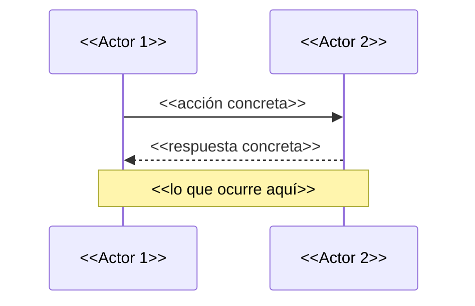

# Informe del Componente — Proyecto Fin de Fase I

> **Curso:** IFCD0112 — Programación con Lenguajes OO y BBDD Relacionales
> **Fase:** I — Fundamentos (MF0223)
> **Plantilla:** Informe individual (1 por persona del equipo)
> **Acompaña a:** `INFORME_TEAM_LEADER_PLANTILLA.md`
> **Lee primero:** `GUIA_DOCUMENTACION_PROYECTOS.md`

---

## Cómo usar esta plantilla

1. **Duplícala** como `INFORME_COMPONENTE_<TuNombreApellido>.md`.
2. **Rellena los `<<huecos>>`** con tu trabajo real.
3. **No copies del informe de tu Team Leader** — cuenta TU versión,
   incluso si difiere de la oficial.
4. Las cajas `> [QUÉ PONER · CÓMO ARGUMENTAR · ERROR TÍPICO]` son guías —
   **bórralas** antes de entregar.
5. Si una sección no aplica, escribe *"No aplica porque..."* — eso
   también se evalúa.

---

# 1. Portada

**Nombre completo:** `<< Nombre Apellido >>`
**Rol en el equipo:** `<< ej. Servidor / Red / Cliente / DevOps / QA / Documentación >>`
**Equipo:** `<< nombre del equipo >>`
**Proyecto:** `<< nombre del proyecto del equipo >>`
**Repositorio:** `<< URL >>`
**Mi rama de trabajo principal:** `<< feature/xxx >>`
**Total de commits míos:** `<< nº — ver `git log --author="tu nombre"` >>`

---

# 2. Mi rol en una frase

> [QUÉ PONER] Una sola frase de 2 líneas máximo. Si necesitas más,
> aún no lo tienes claro.
>
> [EJEMPLOS BUENOS]
> - "Configuré la red Host-Only entre 4 VMs y validé conectividad
>   bidireccional con `ping` y `curl`."
> - "Escribí el servidor Python que sirve el script Bash de la misión
>   y persiste la telemetría en disco."
>
> [ERROR TÍPICO] "Hice un poco de todo." → No hiciste nada concreto que
> puedas defender.

`<< Tu frase aquí >>`

---

# 3. Napking o gráficos inicial

> [QUÉ PONER] Foto, escaneo o ASCII del primer dibujo que hiciste el día
> que empezamos a planificar. Si no la guardaste, REDIBÚJALA ahora a
> mano y fotografíala — el ejercicio mental es lo importante.
>
> [POR QUÉ] Demuestra que pensaste antes de programar. Es la marca de
> alguien que va a ser developer de verdad y no copia-pega de
> Stack Overflow.

**Servilleta original / reconstruida:**

`<< ./img/napkin-<tuNombre>.jpg >> ó bloque ASCII:`

```
+--------------------------------------------+
|   << dibuja aquí en ASCII si no tienes >>  |
|   << foto. No te frenes por la estética >> |
+--------------------------------------------+
```

**Qué representaba la servilleta entonces (`<<2-3 líneas>>`):**

`<< Por ej. "pensaba que el cliente pediría /script.sh tal cual y el
servidor lo serviría como archivo plano. No sabía aún que íbamos a
generar el script al vuelo." >>`

**Qué cambió entre la servilleta y la versión final:**

`<< 1-2 líneas. Si no cambió nada... o eres un genio del diseño o no
implementaste tu pieza de verdad. >>`

---

# 4. Mi parte en un diagrama Mermaid

> [QUÉ PONER] UN diagrama (sequence si tu pieza implica interacción
> entre máquinas/procesos, flowchart si es lógica interna).
>
> [CÓMO ARGUMENTAR] Acompáñalo de 4-6 líneas que expliquen:
> qué representa cada actor, qué viaja por cada flecha, dónde está
> el "código tuyo" en ese diagrama.
>
> [ERROR TÍPICO] Diagrama copiado del Team Leader. Aquí se documenta
> SOLO TU pieza, en detalle.



**Lectura del diagrama:**

- `<< actor 1 = ... >>`
- `<< actor 2 = ... >>`
- `<< paso 1 = ... >>`
- `<< paso 2 = ... >>`

---

# 5. Tecnologías que usé (con justificación)

> [QUÉ PONER] Solo las que TÚ tocaste de verdad. No "Linux" si no lo
> configuraste — todo el mundo está sobre Linux.
>
> [ERROR TÍPICO] Tabla con 15 tecnologías de las cuales 12 no te
> arrancarías en otra máquina por tu cuenta.

| Tecnología / comando | Qué hace en mi pieza | Por qué elegí esta y no otra |
|---|---|---|
| `<< ej. python3 -m http.server >>` | `<< sirve los .sh estáticos >>` | `<< zero setup, basta para 4 clientes >>` |
| `<< ej. curl -X POST >>` | `<< envía telemetría al servidor >>` | `<< vs. wget porque... >>` |
| `<< ... >>` | `<< ... >>` | `<< ... >>` |

---

# 6. Comandos clave de MI pieza

> [QUÉ PONER] 3 a 5 bloques de código que YO escribí o configuré.
> Cada bloque con un comentario que explique el QUÉ y el POR QUÉ.
>
> [ERROR TÍPICO] Pegar 200 líneas. Si pegas 200 líneas no entiendes
> qué es relevante. Elige los 3-5 momentos clave de tu pieza.

```bash
# << 1. Qué hace este bloque y por qué es el corazón de mi pieza >>
<<comando o snippet>>
```

```bash
# << 2. ... >>
<<...>>
```

```bash
# << 3. ... >>
<<...>>
```

---

# 7. Decisiones técnicas y descartes

> [QUÉ PONER] Mínimo 2 decisiones. La columna "descarté" es la más
> importante: demuestra que conociste otras opciones.
>
> [POR QUÉ ESTA SECCIÓN] En el mundo real, escribir código es 20 %.
> El otro 80 % es decidir qué NO hacer. Esta tabla es lo que pides en
> un code review serio.

| Probé / consideré | Lo descarté porque | Acabé eligiendo | Por qué fue la mejor |
|---|---|---|---|
| `<<...>>` | `<<...>>` | `<<...>>` | `<<...>>` |
| `<<...>>` | `<<...>>` | `<<...>>` | `<<...>>` |

---

# 8. Problemas que encontré y cómo los resolví

> [QUÉ PONER] Mínimo 2 problemas reales. Estructura: SÍNTOMA →
> DIAGNÓSTICO → FIX → APRENDIZAJE.
>
> [POR QUÉ] Aquí se ve cómo piensa un developer. El que no tuvo
> problemas no implementó nada — o no se enteró.

### Problema 1

- **Síntoma:** `<<lo que veía: error, comportamiento raro, cuelgue, etc.>>`
- **Diagnóstico:** `<<qué pasos di para localizar la causa: logs, ping,
  modificar variables, leer manuales, preguntar...>>`
- **Fix:** `<<qué cambié exactamente>>`
- **Aprendizaje:** `<<frase de 1 línea que me llevo de esto>>`

### Problema 2

- **Síntoma:** `<<...>>`
- **Diagnóstico:** `<<...>>`
- **Fix:** `<<...>>`
- **Aprendizaje:** `<<...>>`

### Problema 3 *(opcional)*

`<<...>>`

---

# 9. Cómo me integré con mis compañeros

> [QUÉ PONER] El punto exacto donde MI pieza se conecta con la de
> otra persona. Sé concreto: qué le entrego, qué espero de él/ella,
> y qué pasaba cuando uno de los dos estaba a medias.
>
> [ERROR TÍPICO] "Hablábamos por WhatsApp" — eso no es integración
> técnica, es comunicación humana. Las dos cosas se documentan, pero
> aquí queremos la técnica.

| Compañero | En qué punto técnico me conecto con él/ella | Qué le entrego / qué espero |
|---|---|---|
| `<<Nombre>>` | `<<ej. su servidor expone /go, yo le pido /go desde mi cliente>>` | `<<le envío User-Agent personalizado, espero un .sh con cabecera #!/bin/bash>>` |
| `<<Nombre>>` | `<<...>>` | `<<...>>` |

---

# 10. Uso documentado de la IA (sección obligatoria)

> [POR QUÉ] La diferencia entre un developer y alguien que copia respuestas
> está aquí: NO en NO usar IA, sino en cómo la usas, qué le pides, qué
> revisas, qué corriges. Esta sección demuestra que mantienes el control.
>
> [QUÉ PONER] Para AL MENOS UN diagrama Mermaid de los anteriores:
> el prompt LITERAL que escribiste, el diagrama CRUDO que te devolvió
> la IA, y las correcciones que hiciste a mano (con razones).
>
> [ERROR TÍPICO] Pegar solo el resultado final pulido. Aquí queremos
> el "antes". Si te da vergüenza pegarlo, es que estás aprendiendo
> de verdad.

## 10.1. Mi prompt literal

```
<< Pega aquí, palabra por palabra, el prompt que le diste a Claude /
ChatGPT / la IA que uses. Incluye contexto previo si lo dabas. >>
```

## 10.2. Diagrama crudo que me devolvió

```mermaid
<< el output de la IA tal cual — sin tocarlo >>
```

## 10.3. Correcciones que hice y por qué

| Cambio que hice | Por qué (qué estaba mal o incompleto) |
|---|---|
| `<<ej. cambié "Cliente" por "VM-Alumno-XX">>` | `<<la IA no sabía que cada alumno tiene su propia VM>>` |
| `<<ej. añadí flecha de POST /upload>>` | `<<la IA omitió la telemetría que sí implementé>>` |
| `<<...>>` | `<<...>>` |

## 10.4. Lo que la IA NO sabía sobre mi proyecto

> [QUÉ PONER] 2-3 cosas que solo TÚ sabías porque estuviste en clase /
> tocaste el código / hablaste con tu equipo. Esto demuestra el valor
> que tú aportas frente a la IA.

- `<<...>>`
- `<<...>>`
- `<<...>>`

---

# 11. Capturas (evidencia visual)

> [QUÉ PONER] Mínimo 2 capturas:
> - 1 de tu terminal con tu pieza funcionando
> - 1 de `git log --oneline --graph` con tus commits
>
> [BONUS] Una de tu navegador con tu cuenta de GitHub mostrando el
> tablero Kanban con tarjetas tuyas movidas a "Done".

**Captura 1 — `<<descripción de qué se ve>>`:**

`<<./img/captura-<tunombre>-1.png>>`

**Captura 2 — mi historial de commits:**

```bash
$ git log --oneline --graph --author="<<Tu Nombre>>"
<< pega aquí el output real >>
```

---

# 12. Reflexión sobre el equipo (sección obligatoria)

> [POR QUÉ ESTA SECCIÓN] Aprender a programar en grupo es aprender a
> ser developer en una empresa. En clase y en una empresa de verdad,
> las cosas no se hacen como en el cole — nadie te va a dar la receta
> exacta de cómo distribuir el trabajo. Quiero saber qué viste, qué
> aprendiste de los demás y de ti mismo en esta dinámica.
>
> [REGLA DE ORO] Sé concreto. No "todos buena onda" — di qué pasó,
> qué hiciste, qué te llevas. Y no pongas mal a nadie por nombre:
> describe situaciones, no acuses personas.

## 12.1. ¿Cómo nos organizamos realmente?

> Olvida el plan inicial. ¿Cómo decidisteis quién hacía qué?
> ¿Quién tendía a tirar del grupo? ¿En qué momentos hubo descoordinación?
> ¿Quién proponía y quién esperaba?

`<<1-2 párrafos>>`

## 12.2. ¿Qué hice cuando alguien de mi equipo se atascó?

> ¿Ayudaste? ¿Esperaste? ¿Asumiste su parte? ¿Le explicaste? ¿Pasaste?
> No hay respuesta correcta — pero la honesta dice mucho de ti.

`<<1 párrafo>>`

## 12.3. ¿Qué hicieron cuando me atasqué yo?

> ¿Pediste ayuda? ¿O preferiste pelearte solo con el problema? ¿Cómo
> respondieron? ¿Qué aprendiste de cómo pediste o no pediste ayuda?

`<<1 párrafo>>`

## 12.4. ¿Qué he aprendido de cada compañero (técnica o humanamente)?

> [INSTRUCCIONES] Por cada compañero, una frase honesta. Lo bueno
> concreto, sin amiguismo de quedar bien.

| Compañero | Algo concreto que le aprendí / observé |
|---|---|
| `<<Nombre>>` | `<<ej. la rapidez con la que descartaba caminos sin obsesionarse — buen instinto>>` |
| `<<Nombre>>` | `<<...>>` |

## 12.5. ¿En qué se pareció esto a un trabajo real y en qué no?

> Piensa en lo que sabes de cómo trabaja una empresa de software:
> sprints, daily, code reviews, jefes técnicos, deadlines. ¿Qué viste
> aquí de eso? ¿Qué te faltó? ¿Qué sospechas que está siendo cole y
> no será así fuera?

`<<1-2 párrafos>>`

## 12.6. Si volviéramos a empezar este equipo mañana, ¿qué pediría o propondría?

> Mínimo 2 cosas. Una de proceso, una técnica.

- **Proceso:** `<<...>>`
- **Técnica:** `<<...>>`

---

# 13. Qué haría diferente la próxima vez (yo, solo yo)

> [QUÉ PONER] Mínimo 2 puntos. Mira solo tu trabajo, no el del equipo.
>
> [ERROR TÍPICO] "Empezar antes." Demasiado fácil. Concreta: ¿antes
> para qué exactamente?, ¿qué harías ese día extra?

1. `<<...>>`
2. `<<...>>`
3. `<<...>>` *(opcional)*

---

# 14. Anexos

- Enlace a mi rama: `<<...>>`
- Enlace a la PR (si la hubo): `<<...>>`
- Materiales externos que consulté:
  - `<<URL + qué saqué de ahí>>`
  - `<<URL + qué saqué de ahí>>`

---

*Informe individual — Proyecto fin de Fase I (MF0223)
Curso IFCD0112 · Prof. Juan Marcelo Gutierrez Miranda — todoeconometria.com*
