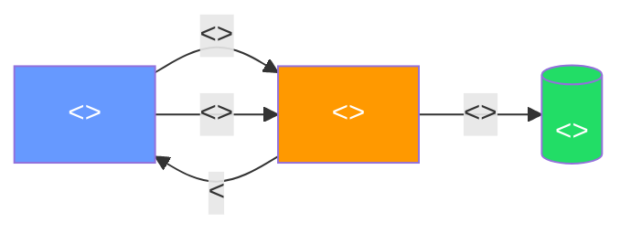

# Informe Team Leader — Proyecto Fin de Fase I

> **Curso:** IFCD0112 — Programación con Lenguajes OO y BBDD Relacionales
> **Fase:** I — Fundamentos (MF0223)
> **Plantilla:** Informe del Team Leader (1 por equipo)
> **Acompaña a:** `INFORME_COMPONENTE_PLANTILLA.md` (1 por persona)
> **Lee primero:** `GUIA_DOCUMENTACION_PROYECTOS.md`

---

## Cómo usar esta plantilla

1. **No la borres.** Duplícala como `INFORME_TEAM_LEADER_<NombreProyecto>.md`.
2. **Sustituye los `<<huecos>>`** por tu contenido real.
3. **Mantén la estructura** (encabezados y orden). Si tu proyecto no tiene
   algo, escribe *"No aplica en este proyecto porque..."* — eso también
   se valora.
4. **No copies texto de tus compañeros** ni del README de ninguna
   herramienta. Aquí se mide lo que tú entendiste, no lo que tú pegaste.
5. Las cajas `> [QUÉ PONER · CÓMO ARGUMENTAR · ERROR TÍPICO]` son guías —
   **bórralas** del informe final.

---

# 1. Portada

**Nombre del proyecto:** `<< ej. "Misión Helios — onboarding gamificado para juniors" >>`

**Equipo:** `<< Nombre del equipo o el que os pusisteis >>`

**Componentes del equipo:**

| Persona | Rol | Enlace a su informe |
|---|---|---|
| `<< Nombre Apellido (Team Leader — tú) >>` | Team Leader / `<<rol técnico extra>>` | (este documento) |
| `<< Nombre Apellido >>` | `<< ej. Servidor / Red / Cliente / DevOps / QA >>` | `[Informe](./INFORME_COMPONENTE_NombreApellido.md)` |
| `<< ... >>` | `<< ... >>` | `<< ... >>` |

**Repositorio:** `<< URL de GitHub o ruta local >>`
**Branch principal del proyecto:** `<< main / master / develop... >>`
**Tablero Kanban:** `<< URL del tablero de GitHub Projects >>`
**Fechas de trabajo:** `<< DD-MM-AA → DD-MM-AA >>` · **Horas reales invertidas estimadas:** `<< nº >>`

---

# 2. Resumen ejecutivo

> [QUÉ PONER] Un párrafo de 4-6 líneas. Si alguien lee SOLO esto, debe
> saber: qué hace tu proyecto, para quién, con qué tecnologías, qué pinta
> tiene el resultado final.
>
> [CÓMO ARGUMENTAR] Habla en presente y en activa. No digas "intentamos",
> di "construimos". Si algo no funcionó del todo, sé honesto pero
> profesional.
>
> [ERROR TÍPICO] Listar 15 tecnologías. No es un CV — es un resumen.

`<< Tu párrafo aquí. Borra la caja de arriba. >>`

---

# 3. Objetivos vs. resultados

> [QUÉ PONER] La tabla tal cual. Si un objetivo no se cumplió, déjalo
> en "Parcial" o "No alcanzado" y explica en una línea por qué.
>
> [CÓMO ARGUMENTAR] Las "evidencias" deben ser archivos, comandos o
> capturas reales. "Funciona" no es evidencia; "ver `src/cliente.sh` y
> captura en sección 8" sí.
>
> [ERROR TÍPICO] Marcar todo como "completado al 100 %" cuando no lo está
> — el profesor abrirá el repo y lo verá.

| # | Objetivo inicial | Estado | Evidencia |
|---|---|---|---|
| 1 | `<< ej. Servidor Python responde /go en red local >>` | `<< Completado / Parcial / No alcanzado >>` | `<< archivo o sección de este informe >>` |
| 2 | `<< ... >>` | `<< ... >>` | `<< ... >>` |
| 3 | `<< ... >>` | `<< ... >>` | `<< ... >>` |
| 4 | `<< ... >>` | `<< ... >>` | `<< ... >>` |

---

# 4. Arquitectura general

> [QUÉ PONER] UN diagrama Mermaid que muestre las cajas (componentes) y
> las flechas (cómo se comunican). Las cajas deben coincidir con los
> componentes que escribieron informe individual.
>
> [CÓMO ARGUMENTAR] Acompáñalo de 3-4 líneas: qué representa cada caja y
> qué viaja por cada flecha (no "datos" — sé concreto: "petición HTTP
> GET /go", "script bash por stdin", "JSON con telemetría").
>
> [ERROR TÍPICO] Diagrama bonito pero abstracto donde no se entiende
> quién habla con quién ni con qué protocolo.



**Lectura del diagrama (`<<3-4 líneas>>`):**

- `<<Cliente: ...>>`
- `<<Servidor: ...>>`
- `<<Almacenamiento: ...>>`

---

# 5. Equipo y reparto del trabajo

> [QUÉ PONER] Tabla con qué hizo cada persona realmente (no lo que dijo
> el plan al principio).
>
> [CÓMO ARGUMENTAR] Concreta entregables. "Hizo la red" → mal.
> "Configuró Host-Only Network entre 4 VMs, documentó IPs y probó
> conectividad bidireccional" → bien.
>
> [ERROR TÍPICO] Repartir el mérito a partes iguales por no incomodar.
> Aquí se valora honestidad — los componentes ya cuentan su versión en
> sus propios informes.

| Persona | Rol técnico real | Entregables principales | % de su tiempo dedicado al proyecto |
|---|---|---|---|
| `<< yo (TL) >>` | `<< ... >>` | `<< ... >>` | `<< ej. 100 % >>` |
| `<< Nombre >>` | `<< ... >>` | `<< ... >>` | `<< ej. 80 % — ausente martes >>` |
| `<< Nombre >>` | `<< ... >>` | `<< ... >>` | `<< ... >>` |

---

# 6. Cronograma real

> [QUÉ PONER] Hitos reales con fechas. Si quieres lucirte: un Mermaid
> `gantt`. Si vas justo de tiempo: una lista con bullets.
>
> [CÓMO ARGUMENTAR] El profesor vio el aula esos días. No infles.
>
> [ERROR TÍPICO] Gantt bonito pero con fechas inventadas.

```mermaid
gantt
    title Cronograma del proyecto
    dateFormat YYYY-MM-DD
    section Diseño
    Servilletas y arquitectura       :a1, 2026-05-XX, 1d
    section Implementación
    Servidor                         :a2, 2026-05-XX, 2d
    Cliente                          :a3, 2026-05-XX, 2d
    Red entre VMs                    :a4, 2026-05-XX, 1d
    section Integración
    Pruebas cruzadas                 :a5, 2026-05-XX, 1d
    section Cierre
    Documentación                    :a6, 2026-05-XX, 1d
```

**Hitos clave en una línea:**

- `<< DD-MM: ... >>`
- `<< DD-MM: ... >>`
- `<< DD-MM: ... >>`

---

# 7. Tablero Kanban — narrativa

> [QUÉ PONER] Captura del tablero final + 1 párrafo que cuente la
> historia: qué se movió, qué se quedó bloqueado, qué scope se recortó
> a mitad del proyecto.
>
> [CÓMO ARGUMENTAR] El Kanban es la prueba de vida del equipo. Si está
> vacío o todo en "Done" sin tarjetas intermedias, se nota mucho.
>
> [ERROR TÍPICO] Pegar la captura y no contar nada. La captura sin
> contexto es decoración.

**Captura del tablero (estado final):**

`<< captura.png o referencia a ./img/kanban-final.png >>`

**Narrativa del tablero (`<<1 párrafo, 5-8 líneas>>`):**

`<< Empezamos con X tarjetas en "To Do"... Movimos Y a "In Progress"
durante la primera sesión... La tarjeta Z se quedó bloqueada porque...
Recortamos el alcance de... La tarjeta W la añadimos a mitad porque
descubrimos que... >>`

---

# 8. Demo / cómo reproducirlo

> [QUÉ PONER] Pasos copy-paste para que YO (profesor) lo arranque en
> una VM limpia en menos de 10 minutos. Mínimo: requisitos previos,
> clone, comandos, verificación.
>
> [CÓMO ARGUMENTAR] Numera los pasos. Cada paso es un comando o una
> acción atómica.
>
> [ERROR TÍPICO] "Sigue el README" — no tenéis README todavía, y si lo
> tenéis lo que pongo aquí debe poder leerse sin abrir nada más.

**Requisitos previos:**

- `<<ej. VirtualBox 7.x>>`
- `<<ej. 2 VMs Ubuntu en red Host-Only o NAT-Network>>`
- `<<...>>`

**Pasos:**

```bash
# 1. Clonar el repo en la VM "servidor"
git clone <<URL>>
cd <<carpeta>>

# 2. Arrancar el servidor
<<comando exacto>>

# 3. Desde la VM "cliente":
<<comando exacto>>

# 4. Verificación: debe verse...
<<qué se ve si todo va bien>>
```

**Vídeo / GIF de la demo (opcional pero suma):** `<< enlace o ./demo.gif >>`

---

# 9. Reflexión del Team Leader

> [POR QUÉ ESTA SECCIÓN] Aquí no se evalúa el código — se evalúa cómo
> piensas como líder. Estas preguntas las pasarías en una entrevista
> de trabajo el día que pidas un puesto de tech lead junior.
> Sé honesto: las respuestas vacías o genéricas se ven a 1 km.

## 9.1. Cómo distribuí el trabajo y por qué

> [QUÉ PONER] Tu criterio real al repartir tareas: ¿por afinidad
> técnica?, ¿por carga?, ¿porque alguien lo pidió?, ¿porque nadie
> quería ese trozo y te tocó imponer?

`<< 1 párrafo >>`

## 9.2. Decisiones que tomé sin consultar al equipo

> [QUÉ PONER] Al menos 1 decisión donde NO hubo asamblea — la tomaste
> tú por velocidad o por criterio. Y por qué la tomaste así.
> Liderar también es decidir solo cuando toca.

`<< 1-2 párrafos. Si dices "todo lo decidimos juntos" probablemente no
fuiste team leader, fuiste secretario del grupo. >>`

## 9.3. Lo que decía el plan vs. lo que pasó en realidad

> [QUÉ PONER] 2-3 desviaciones del plan inicial. Sin culpar a nadie:
> los planes se rompen, los buenos líderes lo asumen.

| Lo que dijimos al principio | Lo que pasó | Cómo respondí |
|---|---|---|
| `<<...>>` | `<<...>>` | `<<...>>` |
| `<<...>>` | `<<...>>` | `<<...>>` |

## 9.4. Cómo gestioné conflictos o fricciones

> [QUÉ PONER] Si NO hubo conflictos en todo el proyecto, o no hubo
> proyecto, o no había confianza en el equipo para discrepar. Cuéntalo
> con discreción: nada de poner verde a nadie por nombre, pero sí
> describe la dinámica. Ejemplo: "hubo un desacuerdo sobre el orden
> de las fases del cliente; lo resolvimos haciendo una prueba rápida
> de las dos versiones."

`<< 1-2 párrafos >>`

## 9.5. Lo que vi en cada compañero (mirada de futuro profesional)

> [QUÉ PONER] Por cada compañero, 2 líneas: una fortaleza que viste y
> un área de crecimiento. Esto NO es para criticar — es para entrenar
> tu ojo de líder. Hazlo con cariño y precisión.
>
> [ERROR TÍPICO] "Todos son muy buenos compañeros" — eso no es
> liderazgo, es cortesía. Específico, por favor.

| Compañero | Su fortaleza concreta | Su área de crecimiento (con tacto) |
|---|---|---|
| `<<Nombre>>` | `<<...>>` | `<<...>>` |
| `<<Nombre>>` | `<<...>>` | `<<...>>` |

## 9.6. Si volviera a liderar este equipo, ¿qué cambiaría?

> [QUÉ PONER] Mínimo 2 cosas. Una de proceso (reuniones, reparto, comms)
> y una técnica (orden de implementación, scope, herramientas).

`<< 1-2 párrafos >>`

---

# 10. Aprendizajes técnicos del equipo

> [QUÉ PONER] 3 + 3 + 3: tres cosas que salieron bien, tres que no, tres
> que repetirías en el próximo proyecto.
>
> [ERROR TÍPICO] Frases vacías como "aprendimos a trabajar en equipo".
> Concreta: "aprendimos que `python3 -m http.server` escucha en 127.0.0.1
> por defecto y hay que pasar `--bind 0.0.0.0` si quieres acceso desde
> otra VM".

**Salieron bien:**
1. `<<...>>`
2. `<<...>>`
3. `<<...>>`

**Salieron mal o regulares:**
1. `<<...>>`
2. `<<...>>`
3. `<<...>>`

**A repetir en el próximo proyecto:**
1. `<<...>>`
2. `<<...>>`
3. `<<...>>`

---

# 11. Anexos

- `<<Enlace al repo>>`
- `<<Enlace al tablero Kanban>>`
- `<<Enlace a vídeo demo / GIF>>`
- `<<Enlaces a informes de los componentes>>`

---

*Informe del Team Leader — Proyecto fin de Fase I (MF0223)
Curso IFCD0112 · Prof. Juan Marcelo Gutierrez Miranda — todoeconometria.com*
